```python
import numpy as np
import pandas as pd
import matplotlib.pyplot as plt
import seaborn as sns
import warnings

warnings.filterwarnings('ignore')
```

## 0. Load Data


```python
data = pd.read_csv('../data/data.csv')
data.info()
```

    <class 'pandas.core.frame.DataFrame'>
    RangeIndex: 68206 entries, 0 to 68205
    Data columns (total 18 columns):
     #   Column     Non-Null Count  Dtype 
    ---  ------     --------------  ----- 
     0   Fecha-I    68206 non-null  object
     1   Vlo-I      68206 non-null  object
     2   Ori-I      68206 non-null  object
     3   Des-I      68206 non-null  object
     4   Emp-I      68206 non-null  object
     5   Fecha-O    68206 non-null  object
     6   Vlo-O      68205 non-null  object
     7   Ori-O      68206 non-null  object
     8   Des-O      68206 non-null  object
     9   Emp-O      68206 non-null  object
     10  DIA        68206 non-null  int64 
     11  MES        68206 non-null  int64 
     12  AÑO        68206 non-null  int64 
     13  DIANOM     68206 non-null  object
     14  TIPOVUELO  68206 non-null  object
     15  OPERA      68206 non-null  object
     16  SIGLAORI   68206 non-null  object
     17  SIGLADES   68206 non-null  object
    dtypes: int64(3), object(15)
    memory usage: 9.4+ MB
    

## 1. Data Analysis: First Sight

### How is the date distribuited?


```python
flights_by_airline = data['OPERA'].value_counts()
plt.figure(figsize = (10, 2))
sns.set(style="darkgrid")
sns.barplot(x=flights_by_airline.index, y=flights_by_airline.values)
plt.title('Flights by Airline')
plt.ylabel('Flights', fontsize=12)
plt.xlabel('Airline', fontsize=12)
plt.xticks(rotation=90)
plt.show()
```


    
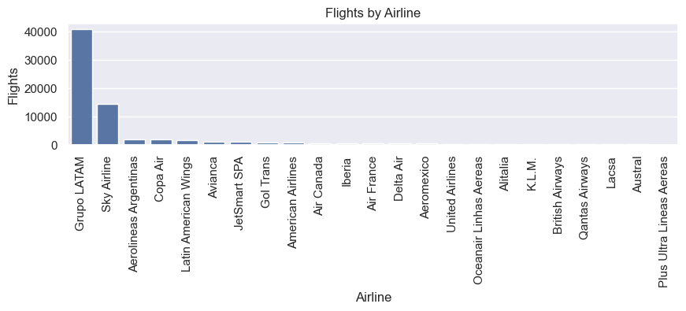
    


```python
flights_by_day = data['DIA'].value_counts()
plt.figure(figsize = (10, 2))
sns.set(style = "darkgrid")
sns.barplot(x=flights_by_day.index, y=flights_by_day.values, color = 'lightblue', alpha=0.8)
plt.title('Flights by Day')
plt.ylabel('Flights', fontsize=12)
plt.xlabel('Day', fontsize=12)
plt.xticks(rotation=90)
plt.show()
```


    
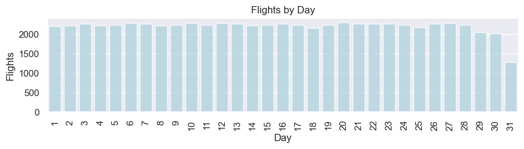
    


```python
flights_by_month = data['MES'].value_counts()
plt.figure(figsize = (10, 2))
sns.set(style = "darkgrid")
sns.barplot(x=flights_by_month.index, y=flights_by_month.values, color = 'lightblue', alpha=0.8)
plt.title('Flights by Month')
plt.ylabel('Flights', fontsize=12)
plt.xlabel('Month', fontsize=12)
plt.xticks(rotation=90)
plt.show()
```


    
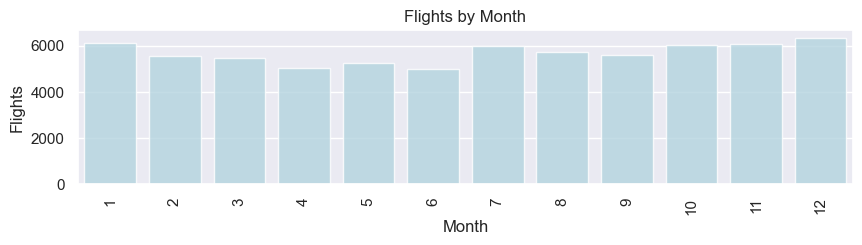
    


```python
flights_by_day_in_week = data['DIANOM'].value_counts()
days = [
    flights_by_day_in_week.index[2], 
    flights_by_day_in_week.index[5], 
    flights_by_day_in_week.index[4], 
    flights_by_day_in_week.index[1], 
    flights_by_day_in_week.index[0], 
    flights_by_day_in_week.index[6], 
    flights_by_day_in_week.index[3]
]
values_by_day = [
    flights_by_day_in_week.values[2], 
    flights_by_day_in_week.values[5], 
    flights_by_day_in_week.values[4], 
    flights_by_day_in_week.values[1], 
    flights_by_day_in_week.values[0], 
    flights_by_day_in_week.values[6], 
    flights_by_day_in_week.values[3]
]
plt.figure(figsize = (10, 2))
sns.set(style="darkgrid")
sns.barplot(x=days, y=values_by_day, color = 'lightblue', alpha=0.8)
plt.title('Flights by Day in Week')
plt.ylabel('Flights', fontsize=12)
plt.xlabel('Day in Week', fontsize=12)
plt.xticks(rotation=90)
plt.show()
```


    
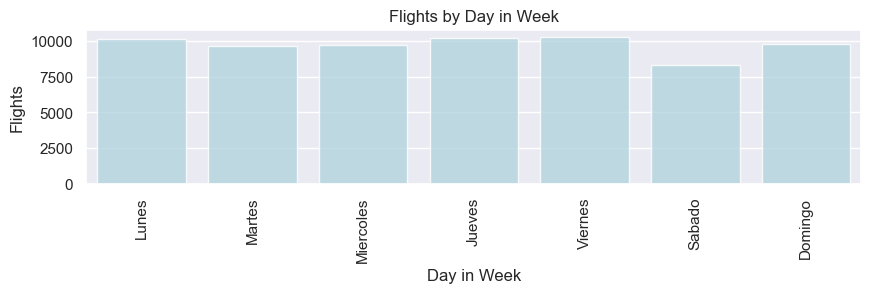
    


```python
flights_by_type = data['TIPOVUELO'].value_counts()
sns.set(style="darkgrid")
plt.figure(figsize = (10, 2))
sns.barplot(x=flights_by_type.index, y=flights_by_type.values, alpha=0.9)
plt.title('Flights by Type')
plt.ylabel('Flights', fontsize=12)
plt.xlabel('Type', fontsize=12)
plt.show()
```


    
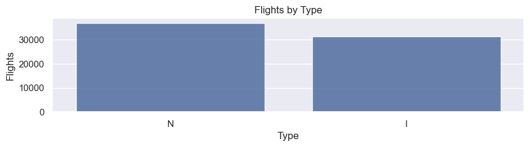
    


```python
flight_by_destination = data['SIGLADES'].value_counts()
plt.figure(figsize = (10, 2))
sns.set(style="darkgrid")
sns.barplot(x=flight_by_destination.index, y=flight_by_destination.values, color = 'lightblue', alpha=0.8)
plt.title('Flight by Destination')
plt.ylabel('Flights', fontsize=12)
plt.xlabel('Destination', fontsize=12)
plt.xticks(rotation=90)

plt.show()
```


    
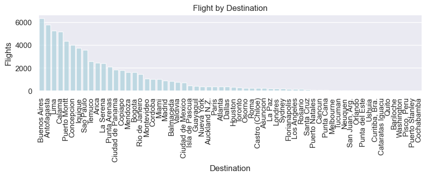
    


## 2. Features Generation

### 2.a. Period of Day


```python
from datetime import datetime

def get_period_day(date):
    date_time = datetime.strptime(date, '%Y-%m-%d %H:%M:%S').time()
    morning_min = datetime.strptime("05:00", '%H:%M').time()
    morning_max = datetime.strptime("11:59", '%H:%M').time()
    afternoon_min = datetime.strptime("12:00", '%H:%M').time()
    afternoon_max = datetime.strptime("18:59", '%H:%M').time()
    evening_min = datetime.strptime("19:00", '%H:%M').time()
    evening_max = datetime.strptime("23:59", '%H:%M').time()
    night_min = datetime.strptime("00:00", '%H:%M').time()
    night_max = datetime.strptime("4:59", '%H:%M').time()
    
    if(date_time > morning_min and date_time < morning_max):
        return 'mañana'
    elif(date_time > afternoon_min and date_time < afternoon_max):
        return 'tarde'
    elif(
        (date_time > evening_min and date_time < evening_max) or
        (date_time > night_min and date_time < night_max)
    ):
        return 'noche'
```


```python
data['period_day'] = data['Fecha-I'].apply(get_period_day)
```

### 2.b. High Season


```python
from datetime import datetime

def is_high_season(fecha):
    fecha_año = int(fecha.split('-')[0])
    fecha = datetime.strptime(fecha, '%Y-%m-%d %H:%M:%S')
    range1_min = datetime.strptime('15-Dec', '%d-%b').replace(year = fecha_año)
    range1_max = datetime.strptime('31-Dec', '%d-%b').replace(year = fecha_año)
    range2_min = datetime.strptime('1-Jan', '%d-%b').replace(year = fecha_año)
    range2_max = datetime.strptime('3-Mar', '%d-%b').replace(year = fecha_año)
    range3_min = datetime.strptime('15-Jul', '%d-%b').replace(year = fecha_año)
    range3_max = datetime.strptime('31-Jul', '%d-%b').replace(year = fecha_año)
    range4_min = datetime.strptime('11-Sep', '%d-%b').replace(year = fecha_año)
    range4_max = datetime.strptime('30-Sep', '%d-%b').replace(year = fecha_año)
    
    if ((fecha >= range1_min and fecha <= range1_max) or 
        (fecha >= range2_min and fecha <= range2_max) or 
        (fecha >= range3_min and fecha <= range3_max) or
        (fecha >= range4_min and fecha <= range4_max)):
        return 1
    else:
        return 0
```


```python
data['high_season'] = data['Fecha-I'].apply(is_high_season)
```

### 2.c. Difference in Minutes


```python
def get_min_diff(data):
    fecha_o = datetime.strptime(data['Fecha-O'], '%Y-%m-%d %H:%M:%S')
    fecha_i = datetime.strptime(data['Fecha-I'], '%Y-%m-%d %H:%M:%S')
    min_diff = ((fecha_o - fecha_i).total_seconds())/60
    return min_diff
```


```python
data['min_diff'] = data.apply(get_min_diff, axis = 1)
```

### 2.d. Delay


```python
threshold_in_minutes = 15
data['delay'] = np.where(data['min_diff'] > threshold_in_minutes, 1, 0)
```


```python
data.columns
```


    Index(['Fecha-I', 'Vlo-I', 'Ori-I', 'Des-I', 'Emp-I', 'Fecha-O', 'Vlo-O',
           'Ori-O', 'Des-O', 'Emp-O', 'DIA', 'MES', 'AÑO', 'DIANOM', 'TIPOVUELO',
           'OPERA', 'SIGLAORI', 'SIGLADES', 'period_day', 'high_season',
           'min_diff', 'delay'],
          dtype='object')


## 3. Data Analysis: Second Sight

### How is the delay rate across columns?


```python
def get_rate_from_column(data, column):
    delays = {}
    for _, row in data.iterrows():
        if row['delay'] == 1:
            if row[column] not in delays:
                delays[row[column]] = 1
            else:
                delays[row[column]] += 1
    total = data[column].value_counts().to_dict()
    
    rates = {}
    for name, total in total.items():
        if name in delays:
            rates[name] = round(total / delays[name], 2)
        else:
            rates[name] = 0
            
    return pd.DataFrame.from_dict(data = rates, orient = 'index', columns = ['Tasa (%)'])
```


```python
destination_rate = get_rate_from_column(data, 'SIGLADES')
destination_rate_values = data['SIGLADES'].value_counts().index
plt.figure(figsize = (20,5))
sns.set(style="darkgrid")
sns.barplot(x=destination_rate_values, y=destination_rate['Tasa (%)'], alpha = 0.75)
plt.title('Delay Rate by Destination')
plt.ylabel('Delay Rate [%]', fontsize=12)
plt.xlabel('Destination', fontsize=12)
plt.xticks(rotation=90)
plt.show()

```


    

    


```python
airlines_rate = get_rate_from_column(data, 'OPERA')
airlines_rate_values = data['OPERA'].value_counts().index
plt.figure(figsize = (20,5))
sns.set(style="darkgrid")
sns.barplot(x=airlines_rate_values, y=airlines_rate['Tasa (%)'], alpha = 0.75)
plt.title('Delay Rate by Airline')
plt.ylabel('Delay Rate [%]', fontsize=12)
plt.xlabel('Airline', fontsize=12)
plt.xticks(rotation=90)
plt.show()
```


    
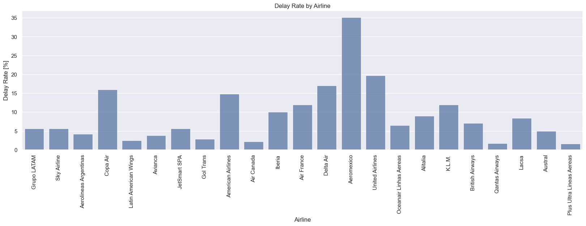
    


```python
month_rate = get_rate_from_column(data, 'MES')
month_rate_value = data['MES'].value_counts().index
plt.figure(figsize = (20,5))
sns.set(style="darkgrid")
sns.barplot(x=month_rate_value, y=month_rate['Tasa (%)'], color = 'blue', alpha = 0.75)
plt.title('Delay Rate by Month')
plt.ylabel('Delay Rate [%]', fontsize=12)
plt.xlabel('Month', fontsize=12)
plt.xticks(rotation=90)
plt.ylim(0,10)
plt.show()
```


    
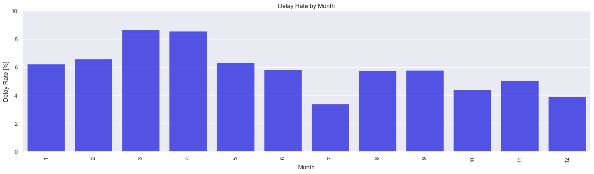
    


```python
days_rate = get_rate_from_column(data, 'DIANOM')
days_rate_value = data['DIANOM'].value_counts().index

sns.set(style="darkgrid")
plt.figure(figsize = (20, 5))
sns.barplot(x=days_rate_value, y=days_rate['Tasa (%)'], color = 'blue', alpha = 0.75)
plt.title('Delay Rate by Day')
plt.ylabel('Delay Rate [%]', fontsize=12)
plt.xlabel('Days', fontsize=12)
plt.xticks(rotation=90)
plt.ylim(0,7)
plt.show()
```


    
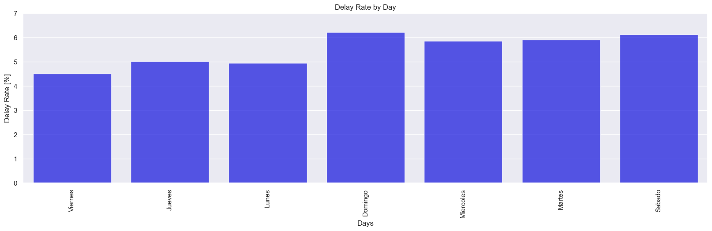
    


```python
high_season_rate = get_rate_from_column(data, 'high_season')
high_season_rate_values = data['high_season'].value_counts().index

plt.figure(figsize = (5, 2))
sns.set(style="darkgrid")
sns.barplot(x=["no", "yes"], y=high_season_rate['Tasa (%)'])
plt.title('Delay Rate by Season')
plt.ylabel('Delay Rate [%]', fontsize=12)
plt.xlabel('High Season', fontsize=12)
plt.xticks(rotation=90)
plt.ylim(0,6)
plt.show()
```


    
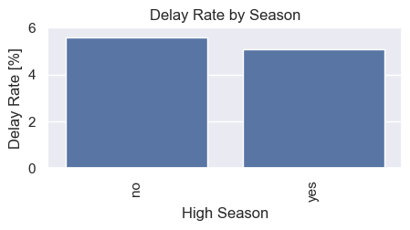
    


```python
flight_type_rate = get_rate_from_column(data, 'TIPOVUELO')
flight_type_rate_values = data['TIPOVUELO'].value_counts().index
plt.figure(figsize = (5, 2))
sns.set(style="darkgrid")
sns.barplot(x=flight_type_rate_values, y=flight_type_rate['Tasa (%)'])
plt.title('Delay Rate by Flight Type')
plt.ylabel('Delay Rate [%]', fontsize=12)
plt.xlabel('Flight Type', fontsize=12)
plt.ylim(0,7)
plt.show()
```


    
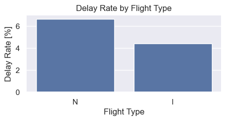
    


```python
period_day_rate = get_rate_from_column(data, 'period_day')
period_day_rate_values = data['period_day'].value_counts().index
plt.figure(figsize = (5, 2))
sns.set(style="darkgrid")
sns.barplot(x=period_day_rate_values, y=period_day_rate['Tasa (%)'])
plt.title('Delay Rate by Period of Day')
plt.ylabel('Delay Rate [%]', fontsize=12)
plt.xlabel('Period', fontsize=12)
plt.ylim(3,7)
plt.show()
```


    
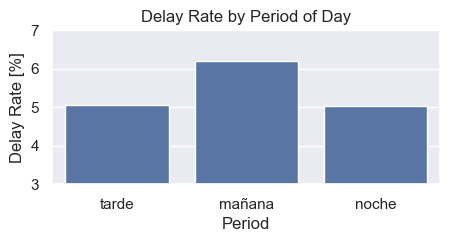
    


## 4. Training

### 4.a. Data Split (Training and Validation)


```python
from sklearn.model_selection import train_test_split
from sklearn.utils import shuffle
from sklearn.metrics import confusion_matrix, classification_report
```


```python
training_data = shuffle(data[['OPERA', 'MES', 'TIPOVUELO', 'SIGLADES', 'DIANOM', 'delay']], random_state = 111)
```


```python
features = pd.concat([
    pd.get_dummies(data['OPERA'], prefix = 'OPERA'),
    pd.get_dummies(data['TIPOVUELO'], prefix = 'TIPOVUELO'), 
    pd.get_dummies(data['MES'], prefix = 'MES')], 
    axis = 1
)
target = data['delay']
```


```python
x_train, x_test, y_train, y_test = train_test_split(features, target, test_size = 0.33, random_state = 42)
```


```python
print(f"train shape: {x_train.shape} | test shape: {x_test.shape}")
```

    train shape: (45698, 37) | test shape: (22508, 37)
    


```python
y_train.value_counts('%')*100
```


    delay
    0    81.618452
    1    18.381548
    Name: proportion, dtype: float64


```python
y_test.value_counts('%')*100
```


    delay
    0    81.277768
    1    18.722232
    Name: proportion, dtype: float64


### 4.b. Model Selection

#### 4.b.i. XGBoost


```python
import xgboost as xgb
from xgboost import plot_importance
```


```python
xgb_model = xgb.XGBClassifier(random_state=1, learning_rate=0.01)
xgb_model.fit(x_train, y_train)
```


<style>#sk-container-id-1 {
  /* Definition of color scheme common for light and dark mode */
  --sklearn-color-text: #000;
  --sklearn-color-text-muted: #666;
  --sklearn-color-line: gray;
  /* Definition of color scheme for unfitted estimators */
  --sklearn-color-unfitted-level-0: #fff5e6;
  --sklearn-color-unfitted-level-1: #f6e4d2;
  --sklearn-color-unfitted-level-2: #ffe0b3;
  --sklearn-color-unfitted-level-3: chocolate;
  /* Definition of color scheme for fitted estimators */
  --sklearn-color-fitted-level-0: #f0f8ff;
  --sklearn-color-fitted-level-1: #d4ebff;
  --sklearn-color-fitted-level-2: #b3dbfd;
  --sklearn-color-fitted-level-3: cornflowerblue;

  /* Specific color for light theme */
  --sklearn-color-text-on-default-background: var(--sg-text-color, var(--theme-code-foreground, var(--jp-content-font-color1, black)));
  --sklearn-color-background: var(--sg-background-color, var(--theme-background, var(--jp-layout-color0, white)));
  --sklearn-color-border-box: var(--sg-text-color, var(--theme-code-foreground, var(--jp-content-font-color1, black)));
  --sklearn-color-icon: #696969;

  @media (prefers-color-scheme: dark) {
    /* Redefinition of color scheme for dark theme */
    --sklearn-color-text-on-default-background: var(--sg-text-color, var(--theme-code-foreground, var(--jp-content-font-color1, white)));
    --sklearn-color-background: var(--sg-background-color, var(--theme-background, var(--jp-layout-color0, #111)));
    --sklearn-color-border-box: var(--sg-text-color, var(--theme-code-foreground, var(--jp-content-font-color1, white)));
    --sklearn-color-icon: #878787;
  }
}

#sk-container-id-1 {
  color: var(--sklearn-color-text);
}

#sk-container-id-1 pre {
  padding: 0;
}

#sk-container-id-1 input.sk-hidden--visually {
  border: 0;
  clip: rect(1px 1px 1px 1px);
  clip: rect(1px, 1px, 1px, 1px);
  height: 1px;
  margin: -1px;
  overflow: hidden;
  padding: 0;
  position: absolute;
  width: 1px;
}

#sk-container-id-1 div.sk-dashed-wrapped {
  border: 1px dashed var(--sklearn-color-line);
  margin: 0 0.4em 0.5em 0.4em;
  box-sizing: border-box;
  padding-bottom: 0.4em;
  background-color: var(--sklearn-color-background);
}

#sk-container-id-1 div.sk-container {
  /* jupyter's `normalize.less` sets `[hidden] { display: none; }`
     but bootstrap.min.css set `[hidden] { display: none !important; }`
     so we also need the `!important` here to be able to override the
     default hidden behavior on the sphinx rendered scikit-learn.org.
     See: https://github.com/scikit-learn/scikit-learn/issues/21755 */
  display: inline-block !important;
  position: relative;
}

#sk-container-id-1 div.sk-text-repr-fallback {
  display: none;
}

div.sk-parallel-item,
div.sk-serial,
div.sk-item {
  /* draw centered vertical line to link estimators */
  background-image: linear-gradient(var(--sklearn-color-text-on-default-background), var(--sklearn-color-text-on-default-background));
  background-size: 2px 100%;
  background-repeat: no-repeat;
  background-position: center center;
}

/* Parallel-specific style estimator block */

#sk-container-id-1 div.sk-parallel-item::after {
  content: "";
  width: 100%;
  border-bottom: 2px solid var(--sklearn-color-text-on-default-background);
  flex-grow: 1;
}

#sk-container-id-1 div.sk-parallel {
  display: flex;
  align-items: stretch;
  justify-content: center;
  background-color: var(--sklearn-color-background);
  position: relative;
}

#sk-container-id-1 div.sk-parallel-item {
  display: flex;
  flex-direction: column;
}

#sk-container-id-1 div.sk-parallel-item:first-child::after {
  align-self: flex-end;
  width: 50%;
}

#sk-container-id-1 div.sk-parallel-item:last-child::after {
  align-self: flex-start;
  width: 50%;
}

#sk-container-id-1 div.sk-parallel-item:only-child::after {
  width: 0;
}

/* Serial-specific style estimator block */

#sk-container-id-1 div.sk-serial {
  display: flex;
  flex-direction: column;
  align-items: center;
  background-color: var(--sklearn-color-background);
  padding-right: 1em;
  padding-left: 1em;
}


/* Toggleable style: style used for estimator/Pipeline/ColumnTransformer box that is
clickable and can be expanded/collapsed.
- Pipeline and ColumnTransformer use this feature and define the default style
- Estimators will overwrite some part of the style using the `sk-estimator` class
*/

/* Pipeline and ColumnTransformer style (default) */

#sk-container-id-1 div.sk-toggleable {
  /* Default theme specific background. It is overwritten whether we have a
  specific estimator or a Pipeline/ColumnTransformer */
  background-color: var(--sklearn-color-background);
}

/* Toggleable label */
#sk-container-id-1 label.sk-toggleable__label {
  cursor: pointer;
  display: flex;
  width: 100%;
  margin-bottom: 0;
  padding: 0.5em;
  box-sizing: border-box;
  text-align: center;
  align-items: start;
  justify-content: space-between;
  gap: 0.5em;
}

#sk-container-id-1 label.sk-toggleable__label .caption {
  font-size: 0.6rem;
  font-weight: lighter;
  color: var(--sklearn-color-text-muted);
}

#sk-container-id-1 label.sk-toggleable__label-arrow:before {
  /* Arrow on the left of the label */
  content: "▸";
  float: left;
  margin-right: 0.25em;
  color: var(--sklearn-color-icon);
}

#sk-container-id-1 label.sk-toggleable__label-arrow:hover:before {
  color: var(--sklearn-color-text);
}

/* Toggleable content - dropdown */

#sk-container-id-1 div.sk-toggleable__content {
  display: none;
  text-align: left;
  /* unfitted */
  background-color: var(--sklearn-color-unfitted-level-0);
}

#sk-container-id-1 div.sk-toggleable__content.fitted {
  /* fitted */
  background-color: var(--sklearn-color-fitted-level-0);
}

#sk-container-id-1 div.sk-toggleable__content pre {
  margin: 0.2em;
  border-radius: 0.25em;
  color: var(--sklearn-color-text);
  /* unfitted */
  background-color: var(--sklearn-color-unfitted-level-0);
}

#sk-container-id-1 div.sk-toggleable__content.fitted pre {
  /* unfitted */
  background-color: var(--sklearn-color-fitted-level-0);
}

#sk-container-id-1 input.sk-toggleable__control:checked~div.sk-toggleable__content {
  /* Expand drop-down */
  display: block;
  width: 100%;
  overflow: visible;
}

#sk-container-id-1 input.sk-toggleable__control:checked~label.sk-toggleable__label-arrow:before {
  content: "▾";
}

/* Pipeline/ColumnTransformer-specific style */

#sk-container-id-1 div.sk-label input.sk-toggleable__control:checked~label.sk-toggleable__label {
  color: var(--sklearn-color-text);
  background-color: var(--sklearn-color-unfitted-level-2);
}

#sk-container-id-1 div.sk-label.fitted input.sk-toggleable__control:checked~label.sk-toggleable__label {
  background-color: var(--sklearn-color-fitted-level-2);
}

/* Estimator-specific style */

/* Colorize estimator box */
#sk-container-id-1 div.sk-estimator input.sk-toggleable__control:checked~label.sk-toggleable__label {
  /* unfitted */
  background-color: var(--sklearn-color-unfitted-level-2);
}

#sk-container-id-1 div.sk-estimator.fitted input.sk-toggleable__control:checked~label.sk-toggleable__label {
  /* fitted */
  background-color: var(--sklearn-color-fitted-level-2);
}

#sk-container-id-1 div.sk-label label.sk-toggleable__label,
#sk-container-id-1 div.sk-label label {
  /* The background is the default theme color */
  color: var(--sklearn-color-text-on-default-background);
}

/* On hover, darken the color of the background */
#sk-container-id-1 div.sk-label:hover label.sk-toggleable__label {
  color: var(--sklearn-color-text);
  background-color: var(--sklearn-color-unfitted-level-2);
}

/* Label box, darken color on hover, fitted */
#sk-container-id-1 div.sk-label.fitted:hover label.sk-toggleable__label.fitted {
  color: var(--sklearn-color-text);
  background-color: var(--sklearn-color-fitted-level-2);
}

/* Estimator label */

#sk-container-id-1 div.sk-label label {
  font-family: monospace;
  font-weight: bold;
  display: inline-block;
  line-height: 1.2em;
}

#sk-container-id-1 div.sk-label-container {
  text-align: center;
}

/* Estimator-specific */
#sk-container-id-1 div.sk-estimator {
  font-family: monospace;
  border: 1px dotted var(--sklearn-color-border-box);
  border-radius: 0.25em;
  box-sizing: border-box;
  margin-bottom: 0.5em;
  /* unfitted */
  background-color: var(--sklearn-color-unfitted-level-0);
}

#sk-container-id-1 div.sk-estimator.fitted {
  /* fitted */
  background-color: var(--sklearn-color-fitted-level-0);
}

/* on hover */
#sk-container-id-1 div.sk-estimator:hover {
  /* unfitted */
  background-color: var(--sklearn-color-unfitted-level-2);
}

#sk-container-id-1 div.sk-estimator.fitted:hover {
  /* fitted */
  background-color: var(--sklearn-color-fitted-level-2);
}

/* Specification for estimator info (e.g. "i" and "?") */

/* Common style for "i" and "?" */

.sk-estimator-doc-link,
a:link.sk-estimator-doc-link,
a:visited.sk-estimator-doc-link {
  float: right;
  font-size: smaller;
  line-height: 1em;
  font-family: monospace;
  background-color: var(--sklearn-color-background);
  border-radius: 1em;
  height: 1em;
  width: 1em;
  text-decoration: none !important;
  margin-left: 0.5em;
  text-align: center;
  /* unfitted */
  border: var(--sklearn-color-unfitted-level-1) 1pt solid;
  color: var(--sklearn-color-unfitted-level-1);
}

.sk-estimator-doc-link.fitted,
a:link.sk-estimator-doc-link.fitted,
a:visited.sk-estimator-doc-link.fitted {
  /* fitted */
  border: var(--sklearn-color-fitted-level-1) 1pt solid;
  color: var(--sklearn-color-fitted-level-1);
}

/* On hover */
div.sk-estimator:hover .sk-estimator-doc-link:hover,
.sk-estimator-doc-link:hover,
div.sk-label-container:hover .sk-estimator-doc-link:hover,
.sk-estimator-doc-link:hover {
  /* unfitted */
  background-color: var(--sklearn-color-unfitted-level-3);
  color: var(--sklearn-color-background);
  text-decoration: none;
}

div.sk-estimator.fitted:hover .sk-estimator-doc-link.fitted:hover,
.sk-estimator-doc-link.fitted:hover,
div.sk-label-container:hover .sk-estimator-doc-link.fitted:hover,
.sk-estimator-doc-link.fitted:hover {
  /* fitted */
  background-color: var(--sklearn-color-fitted-level-3);
  color: var(--sklearn-color-background);
  text-decoration: none;
}

/* Span, style for the box shown on hovering the info icon */
.sk-estimator-doc-link span {
  display: none;
  z-index: 9999;
  position: relative;
  font-weight: normal;
  right: .2ex;
  padding: .5ex;
  margin: .5ex;
  width: min-content;
  min-width: 20ex;
  max-width: 50ex;
  color: var(--sklearn-color-text);
  box-shadow: 2pt 2pt 4pt #999;
  /* unfitted */
  background: var(--sklearn-color-unfitted-level-0);
  border: .5pt solid var(--sklearn-color-unfitted-level-3);
}

.sk-estimator-doc-link.fitted span {
  /* fitted */
  background: var(--sklearn-color-fitted-level-0);
  border: var(--sklearn-color-fitted-level-3);
}

.sk-estimator-doc-link:hover span {
  display: block;
}

/* "?"-specific style due to the `<a>` HTML tag */

#sk-container-id-1 a.estimator_doc_link {
  float: right;
  font-size: 1rem;
  line-height: 1em;
  font-family: monospace;
  background-color: var(--sklearn-color-background);
  border-radius: 1rem;
  height: 1rem;
  width: 1rem;
  text-decoration: none;
  /* unfitted */
  color: var(--sklearn-color-unfitted-level-1);
  border: var(--sklearn-color-unfitted-level-1) 1pt solid;
}

#sk-container-id-1 a.estimator_doc_link.fitted {
  /* fitted */
  border: var(--sklearn-color-fitted-level-1) 1pt solid;
  color: var(--sklearn-color-fitted-level-1);
}

/* On hover */
#sk-container-id-1 a.estimator_doc_link:hover {
  /* unfitted */
  background-color: var(--sklearn-color-unfitted-level-3);
  color: var(--sklearn-color-background);
  text-decoration: none;
}

#sk-container-id-1 a.estimator_doc_link.fitted:hover {
  /* fitted */
  background-color: var(--sklearn-color-fitted-level-3);
}

.estimator-table summary {
    padding: .5rem;
    font-family: monospace;
    cursor: pointer;
}

.estimator-table details[open] {
    padding-left: 0.1rem;
    padding-right: 0.1rem;
    padding-bottom: 0.3rem;
}

.estimator-table .parameters-table {
    margin-left: auto !important;
    margin-right: auto !important;
}

.estimator-table .parameters-table tr:nth-child(odd) {
    background-color: #fff;
}

.estimator-table .parameters-table tr:nth-child(even) {
    background-color: #f6f6f6;
}

.estimator-table .parameters-table tr:hover {
    background-color: #e0e0e0;
}

.estimator-table table td {
    border: 1px solid rgba(106, 105, 104, 0.232);
}

.user-set td {
    color:rgb(255, 94, 0);
    text-align: left;
}

.user-set td.value pre {
    color:rgb(255, 94, 0) !important;
    background-color: transparent !important;
}

.default td {
    color: black;
    text-align: left;
}

.user-set td i,
.default td i {
    color: black;
}

.copy-paste-icon {
    background-image: url(data:image/svg+xml;base64,PHN2ZyB4bWxucz0iaHR0cDovL3d3dy53My5vcmcvMjAwMC9zdmciIHZpZXdCb3g9IjAgMCA0NDggNTEyIj48IS0tIUZvbnQgQXdlc29tZSBGcmVlIDYuNy4yIGJ5IEBmb250YXdlc29tZSAtIGh0dHBzOi8vZm9udGF3ZXNvbWUuY29tIExpY2Vuc2UgLSBodHRwczovL2ZvbnRhd2Vzb21lLmNvbS9saWNlbnNlL2ZyZWUgQ29weXJpZ2h0IDIwMjUgRm9udGljb25zLCBJbmMuLS0+PHBhdGggZD0iTTIwOCAwTDMzMi4xIDBjMTIuNyAwIDI0LjkgNS4xIDMzLjkgMTQuMWw2Ny45IDY3LjljOSA5IDE0LjEgMjEuMiAxNC4xIDMzLjlMNDQ4IDMzNmMwIDI2LjUtMjEuNSA0OC00OCA0OGwtMTkyIDBjLTI2LjUgMC00OC0yMS41LTQ4LTQ4bDAtMjg4YzAtMjYuNSAyMS41LTQ4IDQ4LTQ4ek00OCAxMjhsODAgMCAwIDY0LTY0IDAgMCAyNTYgMTkyIDAgMC0zMiA2NCAwIDAgNDhjMCAyNi41LTIxLjUgNDgtNDggNDhMNDggNTEyYy0yNi41IDAtNDgtMjEuNS00OC00OEwwIDE3NmMwLTI2LjUgMjEuNS00OCA0OC00OHoiLz48L3N2Zz4=);
    background-repeat: no-repeat;
    background-size: 14px 14px;
    background-position: 0;
    display: inline-block;
    width: 14px;
    height: 14px;
    cursor: pointer;
}
</style><body><div id="sk-container-id-1" class="sk-top-container"><div class="sk-text-repr-fallback"><pre>XGBClassifier(base_score=None, booster=None, callbacks=None,
              colsample_bylevel=None, colsample_bynode=None,
              colsample_bytree=None, device=None, early_stopping_rounds=None,
              enable_categorical=False, eval_metric=None, feature_types=None,
              feature_weights=None, gamma=None, grow_policy=None,
              importance_type=None, interaction_constraints=None,
              learning_rate=0.01, max_bin=None, max_cat_threshold=None,
              max_cat_to_onehot=None, max_delta_step=None, max_depth=None,
              max_leaves=None, min_child_weight=None, missing=nan,
              monotone_constraints=None, multi_strategy=None, n_estimators=None,
              n_jobs=None, num_parallel_tree=None, ...)</pre><b>In a Jupyter environment, please rerun this cell to show the HTML representation or trust the notebook. <br />On GitHub, the HTML representation is unable to render, please try loading this page with nbviewer.org.</b></div><div class="sk-container" hidden><div class="sk-item"><div class="sk-estimator fitted sk-toggleable"><input class="sk-toggleable__control sk-hidden--visually" id="sk-estimator-id-1" type="checkbox" checked><label for="sk-estimator-id-1" class="sk-toggleable__label fitted sk-toggleable__label-arrow"><div><div>XGBClassifier</div></div><div><a class="sk-estimator-doc-link fitted" rel="noreferrer" target="_blank" href="https://xgboost.readthedocs.io/en/release_3.0.0/python/python_api.html#xgboost.XGBClassifier">?<span>Documentation for XGBClassifier</span></a><span class="sk-estimator-doc-link fitted">i<span>Fitted</span></span></div></label><div class="sk-toggleable__content fitted" data-param-prefix="">
        <div class="estimator-table">
            <details>
                <summary>Parameters</summary>
                <table class="parameters-table">
                  <tbody>

        <tr class="default">
            <td><i class="copy-paste-icon"
                 onclick="copyToClipboard('objective',
                          this.parentElement.nextElementSibling)"
            ></i></td>
            <td class="param">objective&nbsp;</td>
            <td class="value">&#x27;binary:logistic&#x27;</td>
        </tr>


        <tr class="user-set">
            <td><i class="copy-paste-icon"
                 onclick="copyToClipboard('base_score',
                          this.parentElement.nextElementSibling)"
            ></i></td>
            <td class="param">base_score&nbsp;</td>
            <td class="value">None</td>
        </tr>


        <tr class="user-set">
            <td><i class="copy-paste-icon"
                 onclick="copyToClipboard('booster',
                          this.parentElement.nextElementSibling)"
            ></i></td>
            <td class="param">booster&nbsp;</td>
            <td class="value">None</td>
        </tr>


        <tr class="user-set">
            <td><i class="copy-paste-icon"
                 onclick="copyToClipboard('callbacks',
                          this.parentElement.nextElementSibling)"
            ></i></td>
            <td class="param">callbacks&nbsp;</td>
            <td class="value">None</td>
        </tr>


        <tr class="user-set">
            <td><i class="copy-paste-icon"
                 onclick="copyToClipboard('colsample_bylevel',
                          this.parentElement.nextElementSibling)"
            ></i></td>
            <td class="param">colsample_bylevel&nbsp;</td>
            <td class="value">None</td>
        </tr>


        <tr class="user-set">
            <td><i class="copy-paste-icon"
                 onclick="copyToClipboard('colsample_bynode',
                          this.parentElement.nextElementSibling)"
            ></i></td>
            <td class="param">colsample_bynode&nbsp;</td>
            <td class="value">None</td>
        </tr>


        <tr class="user-set">
            <td><i class="copy-paste-icon"
                 onclick="copyToClipboard('colsample_bytree',
                          this.parentElement.nextElementSibling)"
            ></i></td>
            <td class="param">colsample_bytree&nbsp;</td>
            <td class="value">None</td>
        </tr>


        <tr class="user-set">
            <td><i class="copy-paste-icon"
                 onclick="copyToClipboard('device',
                          this.parentElement.nextElementSibling)"
            ></i></td>
            <td class="param">device&nbsp;</td>
            <td class="value">None</td>
        </tr>


        <tr class="user-set">
            <td><i class="copy-paste-icon"
                 onclick="copyToClipboard('early_stopping_rounds',
                          this.parentElement.nextElementSibling)"
            ></i></td>
            <td class="param">early_stopping_rounds&nbsp;</td>
            <td class="value">None</td>
        </tr>


        <tr class="user-set">
            <td><i class="copy-paste-icon"
                 onclick="copyToClipboard('enable_categorical',
                          this.parentElement.nextElementSibling)"
            ></i></td>
            <td class="param">enable_categorical&nbsp;</td>
            <td class="value">False</td>
        </tr>


        <tr class="user-set">
            <td><i class="copy-paste-icon"
                 onclick="copyToClipboard('eval_metric',
                          this.parentElement.nextElementSibling)"
            ></i></td>
            <td class="param">eval_metric&nbsp;</td>
            <td class="value">None</td>
        </tr>


        <tr class="user-set">
            <td><i class="copy-paste-icon"
                 onclick="copyToClipboard('feature_types',
                          this.parentElement.nextElementSibling)"
            ></i></td>
            <td class="param">feature_types&nbsp;</td>
            <td class="value">None</td>
        </tr>


        <tr class="user-set">
            <td><i class="copy-paste-icon"
                 onclick="copyToClipboard('feature_weights',
                          this.parentElement.nextElementSibling)"
            ></i></td>
            <td class="param">feature_weights&nbsp;</td>
            <td class="value">None</td>
        </tr>


        <tr class="user-set">
            <td><i class="copy-paste-icon"
                 onclick="copyToClipboard('gamma',
                          this.parentElement.nextElementSibling)"
            ></i></td>
            <td class="param">gamma&nbsp;</td>
            <td class="value">None</td>
        </tr>


        <tr class="user-set">
            <td><i class="copy-paste-icon"
                 onclick="copyToClipboard('grow_policy',
                          this.parentElement.nextElementSibling)"
            ></i></td>
            <td class="param">grow_policy&nbsp;</td>
            <td class="value">None</td>
        </tr>


        <tr class="user-set">
            <td><i class="copy-paste-icon"
                 onclick="copyToClipboard('importance_type',
                          this.parentElement.nextElementSibling)"
            ></i></td>
            <td class="param">importance_type&nbsp;</td>
            <td class="value">None</td>
        </tr>


        <tr class="user-set">
            <td><i class="copy-paste-icon"
                 onclick="copyToClipboard('interaction_constraints',
                          this.parentElement.nextElementSibling)"
            ></i></td>
            <td class="param">interaction_constraints&nbsp;</td>
            <td class="value">None</td>
        </tr>


        <tr class="user-set">
            <td><i class="copy-paste-icon"
                 onclick="copyToClipboard('learning_rate',
                          this.parentElement.nextElementSibling)"
            ></i></td>
            <td class="param">learning_rate&nbsp;</td>
            <td class="value">0.01</td>
        </tr>


        <tr class="user-set">
            <td><i class="copy-paste-icon"
                 onclick="copyToClipboard('max_bin',
                          this.parentElement.nextElementSibling)"
            ></i></td>
            <td class="param">max_bin&nbsp;</td>
            <td class="value">None</td>
        </tr>


        <tr class="user-set">
            <td><i class="copy-paste-icon"
                 onclick="copyToClipboard('max_cat_threshold',
                          this.parentElement.nextElementSibling)"
            ></i></td>
            <td class="param">max_cat_threshold&nbsp;</td>
            <td class="value">None</td>
        </tr>


        <tr class="user-set">
            <td><i class="copy-paste-icon"
                 onclick="copyToClipboard('max_cat_to_onehot',
                          this.parentElement.nextElementSibling)"
            ></i></td>
            <td class="param">max_cat_to_onehot&nbsp;</td>
            <td class="value">None</td>
        </tr>


        <tr class="user-set">
            <td><i class="copy-paste-icon"
                 onclick="copyToClipboard('max_delta_step',
                          this.parentElement.nextElementSibling)"
            ></i></td>
            <td class="param">max_delta_step&nbsp;</td>
            <td class="value">None</td>
        </tr>


        <tr class="user-set">
            <td><i class="copy-paste-icon"
                 onclick="copyToClipboard('max_depth',
                          this.parentElement.nextElementSibling)"
            ></i></td>
            <td class="param">max_depth&nbsp;</td>
            <td class="value">None</td>
        </tr>


        <tr class="user-set">
            <td><i class="copy-paste-icon"
                 onclick="copyToClipboard('max_leaves',
                          this.parentElement.nextElementSibling)"
            ></i></td>
            <td class="param">max_leaves&nbsp;</td>
            <td class="value">None</td>
        </tr>


        <tr class="user-set">
            <td><i class="copy-paste-icon"
                 onclick="copyToClipboard('min_child_weight',
                          this.parentElement.nextElementSibling)"
            ></i></td>
            <td class="param">min_child_weight&nbsp;</td>
            <td class="value">None</td>
        </tr>


        <tr class="user-set">
            <td><i class="copy-paste-icon"
                 onclick="copyToClipboard('missing',
                          this.parentElement.nextElementSibling)"
            ></i></td>
            <td class="param">missing&nbsp;</td>
            <td class="value">nan</td>
        </tr>


        <tr class="user-set">
            <td><i class="copy-paste-icon"
                 onclick="copyToClipboard('monotone_constraints',
                          this.parentElement.nextElementSibling)"
            ></i></td>
            <td class="param">monotone_constraints&nbsp;</td>
            <td class="value">None</td>
        </tr>


        <tr class="user-set">
            <td><i class="copy-paste-icon"
                 onclick="copyToClipboard('multi_strategy',
                          this.parentElement.nextElementSibling)"
            ></i></td>
            <td class="param">multi_strategy&nbsp;</td>
            <td class="value">None</td>
        </tr>


        <tr class="user-set">
            <td><i class="copy-paste-icon"
                 onclick="copyToClipboard('n_estimators',
                          this.parentElement.nextElementSibling)"
            ></i></td>
            <td class="param">n_estimators&nbsp;</td>
            <td class="value">None</td>
        </tr>


        <tr class="user-set">
            <td><i class="copy-paste-icon"
                 onclick="copyToClipboard('n_jobs',
                          this.parentElement.nextElementSibling)"
            ></i></td>
            <td class="param">n_jobs&nbsp;</td>
            <td class="value">None</td>
        </tr>


        <tr class="user-set">
            <td><i class="copy-paste-icon"
                 onclick="copyToClipboard('num_parallel_tree',
                          this.parentElement.nextElementSibling)"
            ></i></td>
            <td class="param">num_parallel_tree&nbsp;</td>
            <td class="value">None</td>
        </tr>


        <tr class="user-set">
            <td><i class="copy-paste-icon"
                 onclick="copyToClipboard('random_state',
                          this.parentElement.nextElementSibling)"
            ></i></td>
            <td class="param">random_state&nbsp;</td>
            <td class="value">1</td>
        </tr>


        <tr class="user-set">
            <td><i class="copy-paste-icon"
                 onclick="copyToClipboard('reg_alpha',
                          this.parentElement.nextElementSibling)"
            ></i></td>
            <td class="param">reg_alpha&nbsp;</td>
            <td class="value">None</td>
        </tr>


        <tr class="user-set">
            <td><i class="copy-paste-icon"
                 onclick="copyToClipboard('reg_lambda',
                          this.parentElement.nextElementSibling)"
            ></i></td>
            <td class="param">reg_lambda&nbsp;</td>
            <td class="value">None</td>
        </tr>


        <tr class="user-set">
            <td><i class="copy-paste-icon"
                 onclick="copyToClipboard('sampling_method',
                          this.parentElement.nextElementSibling)"
            ></i></td>
            <td class="param">sampling_method&nbsp;</td>
            <td class="value">None</td>
        </tr>


        <tr class="user-set">
            <td><i class="copy-paste-icon"
                 onclick="copyToClipboard('scale_pos_weight',
                          this.parentElement.nextElementSibling)"
            ></i></td>
            <td class="param">scale_pos_weight&nbsp;</td>
            <td class="value">None</td>
        </tr>


        <tr class="user-set">
            <td><i class="copy-paste-icon"
                 onclick="copyToClipboard('subsample',
                          this.parentElement.nextElementSibling)"
            ></i></td>
            <td class="param">subsample&nbsp;</td>
            <td class="value">None</td>
        </tr>


        <tr class="user-set">
            <td><i class="copy-paste-icon"
                 onclick="copyToClipboard('tree_method',
                          this.parentElement.nextElementSibling)"
            ></i></td>
            <td class="param">tree_method&nbsp;</td>
            <td class="value">None</td>
        </tr>


        <tr class="user-set">
            <td><i class="copy-paste-icon"
                 onclick="copyToClipboard('validate_parameters',
                          this.parentElement.nextElementSibling)"
            ></i></td>
            <td class="param">validate_parameters&nbsp;</td>
            <td class="value">None</td>
        </tr>


        <tr class="user-set">
            <td><i class="copy-paste-icon"
                 onclick="copyToClipboard('verbosity',
                          this.parentElement.nextElementSibling)"
            ></i></td>
            <td class="param">verbosity&nbsp;</td>
            <td class="value">None</td>
        </tr>

                  </tbody>
                </table>
            </details>
        </div>
    </div></div></div></div></div><script>function copyToClipboard(text, element) {
    // Get the parameter prefix from the closest toggleable content
    const toggleableContent = element.closest('.sk-toggleable__content');
    const paramPrefix = toggleableContent ? toggleableContent.dataset.paramPrefix : '';
    const fullParamName = paramPrefix ? `${paramPrefix}${text}` : text;

    const originalStyle = element.style;
    const computedStyle = window.getComputedStyle(element);
    const originalWidth = computedStyle.width;
    const originalHTML = element.innerHTML.replace('Copied!', '');

    navigator.clipboard.writeText(fullParamName)
        .then(() => {
            element.style.width = originalWidth;
            element.style.color = 'green';
            element.innerHTML = "Copied!";

            setTimeout(() => {
                element.innerHTML = originalHTML;
                element.style = originalStyle;
            }, 2000);
        })
        .catch(err => {
            console.error('Failed to copy:', err);
            element.style.color = 'red';
            element.innerHTML = "Failed!";
            setTimeout(() => {
                element.innerHTML = originalHTML;
                element.style = originalStyle;
            }, 2000);
        });
    return false;
}

document.querySelectorAll('.fa-regular.fa-copy').forEach(function(element) {
    const toggleableContent = element.closest('.sk-toggleable__content');
    const paramPrefix = toggleableContent ? toggleableContent.dataset.paramPrefix : '';
    const paramName = element.parentElement.nextElementSibling.textContent.trim();
    const fullParamName = paramPrefix ? `${paramPrefix}${paramName}` : paramName;

    element.setAttribute('title', fullParamName);
});
</script></body>


```python
xgboost_y_preds = xgb_model.predict(x_test)
xgboost_y_preds = [1 if y_pred > 0.5 else 0 for y_pred in xgboost_y_preds]
```


```python
confusion_matrix(y_test, xgboost_y_preds)
```


    array([[18294,     0],
           [ 4214,     0]])


```python
print(classification_report(y_test, xgboost_y_preds))
```

                  precision    recall  f1-score   support
    
               0       0.81      1.00      0.90     18294
               1       0.00      0.00      0.00      4214
    
        accuracy                           0.81     22508
       macro avg       0.41      0.50      0.45     22508
    weighted avg       0.66      0.81      0.73     22508
    
    

#### 4.b.ii. Logistic Regression


```python
from sklearn.linear_model import LogisticRegression
```


```python
reg_model = LogisticRegression()
reg_model.fit(x_train, y_train)
```


<style>#sk-container-id-2 {
  /* Definition of color scheme common for light and dark mode */
  --sklearn-color-text: #000;
  --sklearn-color-text-muted: #666;
  --sklearn-color-line: gray;
  /* Definition of color scheme for unfitted estimators */
  --sklearn-color-unfitted-level-0: #fff5e6;
  --sklearn-color-unfitted-level-1: #f6e4d2;
  --sklearn-color-unfitted-level-2: #ffe0b3;
  --sklearn-color-unfitted-level-3: chocolate;
  /* Definition of color scheme for fitted estimators */
  --sklearn-color-fitted-level-0: #f0f8ff;
  --sklearn-color-fitted-level-1: #d4ebff;
  --sklearn-color-fitted-level-2: #b3dbfd;
  --sklearn-color-fitted-level-3: cornflowerblue;

  /* Specific color for light theme */
  --sklearn-color-text-on-default-background: var(--sg-text-color, var(--theme-code-foreground, var(--jp-content-font-color1, black)));
  --sklearn-color-background: var(--sg-background-color, var(--theme-background, var(--jp-layout-color0, white)));
  --sklearn-color-border-box: var(--sg-text-color, var(--theme-code-foreground, var(--jp-content-font-color1, black)));
  --sklearn-color-icon: #696969;

  @media (prefers-color-scheme: dark) {
    /* Redefinition of color scheme for dark theme */
    --sklearn-color-text-on-default-background: var(--sg-text-color, var(--theme-code-foreground, var(--jp-content-font-color1, white)));
    --sklearn-color-background: var(--sg-background-color, var(--theme-background, var(--jp-layout-color0, #111)));
    --sklearn-color-border-box: var(--sg-text-color, var(--theme-code-foreground, var(--jp-content-font-color1, white)));
    --sklearn-color-icon: #878787;
  }
}

#sk-container-id-2 {
  color: var(--sklearn-color-text);
}

#sk-container-id-2 pre {
  padding: 0;
}

#sk-container-id-2 input.sk-hidden--visually {
  border: 0;
  clip: rect(1px 1px 1px 1px);
  clip: rect(1px, 1px, 1px, 1px);
  height: 1px;
  margin: -1px;
  overflow: hidden;
  padding: 0;
  position: absolute;
  width: 1px;
}

#sk-container-id-2 div.sk-dashed-wrapped {
  border: 1px dashed var(--sklearn-color-line);
  margin: 0 0.4em 0.5em 0.4em;
  box-sizing: border-box;
  padding-bottom: 0.4em;
  background-color: var(--sklearn-color-background);
}

#sk-container-id-2 div.sk-container {
  /* jupyter's `normalize.less` sets `[hidden] { display: none; }`
     but bootstrap.min.css set `[hidden] { display: none !important; }`
     so we also need the `!important` here to be able to override the
     default hidden behavior on the sphinx rendered scikit-learn.org.
     See: https://github.com/scikit-learn/scikit-learn/issues/21755 */
  display: inline-block !important;
  position: relative;
}

#sk-container-id-2 div.sk-text-repr-fallback {
  display: none;
}

div.sk-parallel-item,
div.sk-serial,
div.sk-item {
  /* draw centered vertical line to link estimators */
  background-image: linear-gradient(var(--sklearn-color-text-on-default-background), var(--sklearn-color-text-on-default-background));
  background-size: 2px 100%;
  background-repeat: no-repeat;
  background-position: center center;
}

/* Parallel-specific style estimator block */

#sk-container-id-2 div.sk-parallel-item::after {
  content: "";
  width: 100%;
  border-bottom: 2px solid var(--sklearn-color-text-on-default-background);
  flex-grow: 1;
}

#sk-container-id-2 div.sk-parallel {
  display: flex;
  align-items: stretch;
  justify-content: center;
  background-color: var(--sklearn-color-background);
  position: relative;
}

#sk-container-id-2 div.sk-parallel-item {
  display: flex;
  flex-direction: column;
}

#sk-container-id-2 div.sk-parallel-item:first-child::after {
  align-self: flex-end;
  width: 50%;
}

#sk-container-id-2 div.sk-parallel-item:last-child::after {
  align-self: flex-start;
  width: 50%;
}

#sk-container-id-2 div.sk-parallel-item:only-child::after {
  width: 0;
}

/* Serial-specific style estimator block */

#sk-container-id-2 div.sk-serial {
  display: flex;
  flex-direction: column;
  align-items: center;
  background-color: var(--sklearn-color-background);
  padding-right: 1em;
  padding-left: 1em;
}


/* Toggleable style: style used for estimator/Pipeline/ColumnTransformer box that is
clickable and can be expanded/collapsed.
- Pipeline and ColumnTransformer use this feature and define the default style
- Estimators will overwrite some part of the style using the `sk-estimator` class
*/

/* Pipeline and ColumnTransformer style (default) */

#sk-container-id-2 div.sk-toggleable {
  /* Default theme specific background. It is overwritten whether we have a
  specific estimator or a Pipeline/ColumnTransformer */
  background-color: var(--sklearn-color-background);
}

/* Toggleable label */
#sk-container-id-2 label.sk-toggleable__label {
  cursor: pointer;
  display: flex;
  width: 100%;
  margin-bottom: 0;
  padding: 0.5em;
  box-sizing: border-box;
  text-align: center;
  align-items: start;
  justify-content: space-between;
  gap: 0.5em;
}

#sk-container-id-2 label.sk-toggleable__label .caption {
  font-size: 0.6rem;
  font-weight: lighter;
  color: var(--sklearn-color-text-muted);
}

#sk-container-id-2 label.sk-toggleable__label-arrow:before {
  /* Arrow on the left of the label */
  content: "▸";
  float: left;
  margin-right: 0.25em;
  color: var(--sklearn-color-icon);
}

#sk-container-id-2 label.sk-toggleable__label-arrow:hover:before {
  color: var(--sklearn-color-text);
}

/* Toggleable content - dropdown */

#sk-container-id-2 div.sk-toggleable__content {
  display: none;
  text-align: left;
  /* unfitted */
  background-color: var(--sklearn-color-unfitted-level-0);
}

#sk-container-id-2 div.sk-toggleable__content.fitted {
  /* fitted */
  background-color: var(--sklearn-color-fitted-level-0);
}

#sk-container-id-2 div.sk-toggleable__content pre {
  margin: 0.2em;
  border-radius: 0.25em;
  color: var(--sklearn-color-text);
  /* unfitted */
  background-color: var(--sklearn-color-unfitted-level-0);
}

#sk-container-id-2 div.sk-toggleable__content.fitted pre {
  /* unfitted */
  background-color: var(--sklearn-color-fitted-level-0);
}

#sk-container-id-2 input.sk-toggleable__control:checked~div.sk-toggleable__content {
  /* Expand drop-down */
  display: block;
  width: 100%;
  overflow: visible;
}

#sk-container-id-2 input.sk-toggleable__control:checked~label.sk-toggleable__label-arrow:before {
  content: "▾";
}

/* Pipeline/ColumnTransformer-specific style */

#sk-container-id-2 div.sk-label input.sk-toggleable__control:checked~label.sk-toggleable__label {
  color: var(--sklearn-color-text);
  background-color: var(--sklearn-color-unfitted-level-2);
}

#sk-container-id-2 div.sk-label.fitted input.sk-toggleable__control:checked~label.sk-toggleable__label {
  background-color: var(--sklearn-color-fitted-level-2);
}

/* Estimator-specific style */

/* Colorize estimator box */
#sk-container-id-2 div.sk-estimator input.sk-toggleable__control:checked~label.sk-toggleable__label {
  /* unfitted */
  background-color: var(--sklearn-color-unfitted-level-2);
}

#sk-container-id-2 div.sk-estimator.fitted input.sk-toggleable__control:checked~label.sk-toggleable__label {
  /* fitted */
  background-color: var(--sklearn-color-fitted-level-2);
}

#sk-container-id-2 div.sk-label label.sk-toggleable__label,
#sk-container-id-2 div.sk-label label {
  /* The background is the default theme color */
  color: var(--sklearn-color-text-on-default-background);
}

/* On hover, darken the color of the background */
#sk-container-id-2 div.sk-label:hover label.sk-toggleable__label {
  color: var(--sklearn-color-text);
  background-color: var(--sklearn-color-unfitted-level-2);
}

/* Label box, darken color on hover, fitted */
#sk-container-id-2 div.sk-label.fitted:hover label.sk-toggleable__label.fitted {
  color: var(--sklearn-color-text);
  background-color: var(--sklearn-color-fitted-level-2);
}

/* Estimator label */

#sk-container-id-2 div.sk-label label {
  font-family: monospace;
  font-weight: bold;
  display: inline-block;
  line-height: 1.2em;
}

#sk-container-id-2 div.sk-label-container {
  text-align: center;
}

/* Estimator-specific */
#sk-container-id-2 div.sk-estimator {
  font-family: monospace;
  border: 1px dotted var(--sklearn-color-border-box);
  border-radius: 0.25em;
  box-sizing: border-box;
  margin-bottom: 0.5em;
  /* unfitted */
  background-color: var(--sklearn-color-unfitted-level-0);
}

#sk-container-id-2 div.sk-estimator.fitted {
  /* fitted */
  background-color: var(--sklearn-color-fitted-level-0);
}

/* on hover */
#sk-container-id-2 div.sk-estimator:hover {
  /* unfitted */
  background-color: var(--sklearn-color-unfitted-level-2);
}

#sk-container-id-2 div.sk-estimator.fitted:hover {
  /* fitted */
  background-color: var(--sklearn-color-fitted-level-2);
}

/* Specification for estimator info (e.g. "i" and "?") */

/* Common style for "i" and "?" */

.sk-estimator-doc-link,
a:link.sk-estimator-doc-link,
a:visited.sk-estimator-doc-link {
  float: right;
  font-size: smaller;
  line-height: 1em;
  font-family: monospace;
  background-color: var(--sklearn-color-background);
  border-radius: 1em;
  height: 1em;
  width: 1em;
  text-decoration: none !important;
  margin-left: 0.5em;
  text-align: center;
  /* unfitted */
  border: var(--sklearn-color-unfitted-level-1) 1pt solid;
  color: var(--sklearn-color-unfitted-level-1);
}

.sk-estimator-doc-link.fitted,
a:link.sk-estimator-doc-link.fitted,
a:visited.sk-estimator-doc-link.fitted {
  /* fitted */
  border: var(--sklearn-color-fitted-level-1) 1pt solid;
  color: var(--sklearn-color-fitted-level-1);
}

/* On hover */
div.sk-estimator:hover .sk-estimator-doc-link:hover,
.sk-estimator-doc-link:hover,
div.sk-label-container:hover .sk-estimator-doc-link:hover,
.sk-estimator-doc-link:hover {
  /* unfitted */
  background-color: var(--sklearn-color-unfitted-level-3);
  color: var(--sklearn-color-background);
  text-decoration: none;
}

div.sk-estimator.fitted:hover .sk-estimator-doc-link.fitted:hover,
.sk-estimator-doc-link.fitted:hover,
div.sk-label-container:hover .sk-estimator-doc-link.fitted:hover,
.sk-estimator-doc-link.fitted:hover {
  /* fitted */
  background-color: var(--sklearn-color-fitted-level-3);
  color: var(--sklearn-color-background);
  text-decoration: none;
}

/* Span, style for the box shown on hovering the info icon */
.sk-estimator-doc-link span {
  display: none;
  z-index: 9999;
  position: relative;
  font-weight: normal;
  right: .2ex;
  padding: .5ex;
  margin: .5ex;
  width: min-content;
  min-width: 20ex;
  max-width: 50ex;
  color: var(--sklearn-color-text);
  box-shadow: 2pt 2pt 4pt #999;
  /* unfitted */
  background: var(--sklearn-color-unfitted-level-0);
  border: .5pt solid var(--sklearn-color-unfitted-level-3);
}

.sk-estimator-doc-link.fitted span {
  /* fitted */
  background: var(--sklearn-color-fitted-level-0);
  border: var(--sklearn-color-fitted-level-3);
}

.sk-estimator-doc-link:hover span {
  display: block;
}

/* "?"-specific style due to the `<a>` HTML tag */

#sk-container-id-2 a.estimator_doc_link {
  float: right;
  font-size: 1rem;
  line-height: 1em;
  font-family: monospace;
  background-color: var(--sklearn-color-background);
  border-radius: 1rem;
  height: 1rem;
  width: 1rem;
  text-decoration: none;
  /* unfitted */
  color: var(--sklearn-color-unfitted-level-1);
  border: var(--sklearn-color-unfitted-level-1) 1pt solid;
}

#sk-container-id-2 a.estimator_doc_link.fitted {
  /* fitted */
  border: var(--sklearn-color-fitted-level-1) 1pt solid;
  color: var(--sklearn-color-fitted-level-1);
}

/* On hover */
#sk-container-id-2 a.estimator_doc_link:hover {
  /* unfitted */
  background-color: var(--sklearn-color-unfitted-level-3);
  color: var(--sklearn-color-background);
  text-decoration: none;
}

#sk-container-id-2 a.estimator_doc_link.fitted:hover {
  /* fitted */
  background-color: var(--sklearn-color-fitted-level-3);
}

.estimator-table summary {
    padding: .5rem;
    font-family: monospace;
    cursor: pointer;
}

.estimator-table details[open] {
    padding-left: 0.1rem;
    padding-right: 0.1rem;
    padding-bottom: 0.3rem;
}

.estimator-table .parameters-table {
    margin-left: auto !important;
    margin-right: auto !important;
}

.estimator-table .parameters-table tr:nth-child(odd) {
    background-color: #fff;
}

.estimator-table .parameters-table tr:nth-child(even) {
    background-color: #f6f6f6;
}

.estimator-table .parameters-table tr:hover {
    background-color: #e0e0e0;
}

.estimator-table table td {
    border: 1px solid rgba(106, 105, 104, 0.232);
}

.user-set td {
    color:rgb(255, 94, 0);
    text-align: left;
}

.user-set td.value pre {
    color:rgb(255, 94, 0) !important;
    background-color: transparent !important;
}

.default td {
    color: black;
    text-align: left;
}

.user-set td i,
.default td i {
    color: black;
}

.copy-paste-icon {
    background-image: url(data:image/svg+xml;base64,PHN2ZyB4bWxucz0iaHR0cDovL3d3dy53My5vcmcvMjAwMC9zdmciIHZpZXdCb3g9IjAgMCA0NDggNTEyIj48IS0tIUZvbnQgQXdlc29tZSBGcmVlIDYuNy4yIGJ5IEBmb250YXdlc29tZSAtIGh0dHBzOi8vZm9udGF3ZXNvbWUuY29tIExpY2Vuc2UgLSBodHRwczovL2ZvbnRhd2Vzb21lLmNvbS9saWNlbnNlL2ZyZWUgQ29weXJpZ2h0IDIwMjUgRm9udGljb25zLCBJbmMuLS0+PHBhdGggZD0iTTIwOCAwTDMzMi4xIDBjMTIuNyAwIDI0LjkgNS4xIDMzLjkgMTQuMWw2Ny45IDY3LjljOSA5IDE0LjEgMjEuMiAxNC4xIDMzLjlMNDQ4IDMzNmMwIDI2LjUtMjEuNSA0OC00OCA0OGwtMTkyIDBjLTI2LjUgMC00OC0yMS41LTQ4LTQ4bDAtMjg4YzAtMjYuNSAyMS41LTQ4IDQ4LTQ4ek00OCAxMjhsODAgMCAwIDY0LTY0IDAgMCAyNTYgMTkyIDAgMC0zMiA2NCAwIDAgNDhjMCAyNi41LTIxLjUgNDgtNDggNDhMNDggNTEyYy0yNi41IDAtNDgtMjEuNS00OC00OEwwIDE3NmMwLTI2LjUgMjEuNS00OCA0OC00OHoiLz48L3N2Zz4=);
    background-repeat: no-repeat;
    background-size: 14px 14px;
    background-position: 0;
    display: inline-block;
    width: 14px;
    height: 14px;
    cursor: pointer;
}
</style><body><div id="sk-container-id-2" class="sk-top-container"><div class="sk-text-repr-fallback"><pre>LogisticRegression()</pre><b>In a Jupyter environment, please rerun this cell to show the HTML representation or trust the notebook. <br />On GitHub, the HTML representation is unable to render, please try loading this page with nbviewer.org.</b></div><div class="sk-container" hidden><div class="sk-item"><div class="sk-estimator fitted sk-toggleable"><input class="sk-toggleable__control sk-hidden--visually" id="sk-estimator-id-2" type="checkbox" checked><label for="sk-estimator-id-2" class="sk-toggleable__label fitted sk-toggleable__label-arrow"><div><div>LogisticRegression</div></div><div><a class="sk-estimator-doc-link fitted" rel="noreferrer" target="_blank" href="https://scikit-learn.org/1.7/modules/generated/sklearn.linear_model.LogisticRegression.html">?<span>Documentation for LogisticRegression</span></a><span class="sk-estimator-doc-link fitted">i<span>Fitted</span></span></div></label><div class="sk-toggleable__content fitted" data-param-prefix="">
        <div class="estimator-table">
            <details>
                <summary>Parameters</summary>
                <table class="parameters-table">
                  <tbody>

        <tr class="default">
            <td><i class="copy-paste-icon"
                 onclick="copyToClipboard('penalty',
                          this.parentElement.nextElementSibling)"
            ></i></td>
            <td class="param">penalty&nbsp;</td>
            <td class="value">&#x27;l2&#x27;</td>
        </tr>


        <tr class="default">
            <td><i class="copy-paste-icon"
                 onclick="copyToClipboard('dual',
                          this.parentElement.nextElementSibling)"
            ></i></td>
            <td class="param">dual&nbsp;</td>
            <td class="value">False</td>
        </tr>


        <tr class="default">
            <td><i class="copy-paste-icon"
                 onclick="copyToClipboard('tol',
                          this.parentElement.nextElementSibling)"
            ></i></td>
            <td class="param">tol&nbsp;</td>
            <td class="value">0.0001</td>
        </tr>


        <tr class="default">
            <td><i class="copy-paste-icon"
                 onclick="copyToClipboard('C',
                          this.parentElement.nextElementSibling)"
            ></i></td>
            <td class="param">C&nbsp;</td>
            <td class="value">1.0</td>
        </tr>


        <tr class="default">
            <td><i class="copy-paste-icon"
                 onclick="copyToClipboard('fit_intercept',
                          this.parentElement.nextElementSibling)"
            ></i></td>
            <td class="param">fit_intercept&nbsp;</td>
            <td class="value">True</td>
        </tr>


        <tr class="default">
            <td><i class="copy-paste-icon"
                 onclick="copyToClipboard('intercept_scaling',
                          this.parentElement.nextElementSibling)"
            ></i></td>
            <td class="param">intercept_scaling&nbsp;</td>
            <td class="value">1</td>
        </tr>


        <tr class="default">
            <td><i class="copy-paste-icon"
                 onclick="copyToClipboard('class_weight',
                          this.parentElement.nextElementSibling)"
            ></i></td>
            <td class="param">class_weight&nbsp;</td>
            <td class="value">None</td>
        </tr>


        <tr class="default">
            <td><i class="copy-paste-icon"
                 onclick="copyToClipboard('random_state',
                          this.parentElement.nextElementSibling)"
            ></i></td>
            <td class="param">random_state&nbsp;</td>
            <td class="value">None</td>
        </tr>


        <tr class="default">
            <td><i class="copy-paste-icon"
                 onclick="copyToClipboard('solver',
                          this.parentElement.nextElementSibling)"
            ></i></td>
            <td class="param">solver&nbsp;</td>
            <td class="value">&#x27;lbfgs&#x27;</td>
        </tr>


        <tr class="default">
            <td><i class="copy-paste-icon"
                 onclick="copyToClipboard('max_iter',
                          this.parentElement.nextElementSibling)"
            ></i></td>
            <td class="param">max_iter&nbsp;</td>
            <td class="value">100</td>
        </tr>


        <tr class="default">
            <td><i class="copy-paste-icon"
                 onclick="copyToClipboard('multi_class',
                          this.parentElement.nextElementSibling)"
            ></i></td>
            <td class="param">multi_class&nbsp;</td>
            <td class="value">&#x27;deprecated&#x27;</td>
        </tr>


        <tr class="default">
            <td><i class="copy-paste-icon"
                 onclick="copyToClipboard('verbose',
                          this.parentElement.nextElementSibling)"
            ></i></td>
            <td class="param">verbose&nbsp;</td>
            <td class="value">0</td>
        </tr>


        <tr class="default">
            <td><i class="copy-paste-icon"
                 onclick="copyToClipboard('warm_start',
                          this.parentElement.nextElementSibling)"
            ></i></td>
            <td class="param">warm_start&nbsp;</td>
            <td class="value">False</td>
        </tr>


        <tr class="default">
            <td><i class="copy-paste-icon"
                 onclick="copyToClipboard('n_jobs',
                          this.parentElement.nextElementSibling)"
            ></i></td>
            <td class="param">n_jobs&nbsp;</td>
            <td class="value">None</td>
        </tr>


        <tr class="default">
            <td><i class="copy-paste-icon"
                 onclick="copyToClipboard('l1_ratio',
                          this.parentElement.nextElementSibling)"
            ></i></td>
            <td class="param">l1_ratio&nbsp;</td>
            <td class="value">None</td>
        </tr>

                  </tbody>
                </table>
            </details>
        </div>
    </div></div></div></div></div><script>function copyToClipboard(text, element) {
    // Get the parameter prefix from the closest toggleable content
    const toggleableContent = element.closest('.sk-toggleable__content');
    const paramPrefix = toggleableContent ? toggleableContent.dataset.paramPrefix : '';
    const fullParamName = paramPrefix ? `${paramPrefix}${text}` : text;

    const originalStyle = element.style;
    const computedStyle = window.getComputedStyle(element);
    const originalWidth = computedStyle.width;
    const originalHTML = element.innerHTML.replace('Copied!', '');

    navigator.clipboard.writeText(fullParamName)
        .then(() => {
            element.style.width = originalWidth;
            element.style.color = 'green';
            element.innerHTML = "Copied!";

            setTimeout(() => {
                element.innerHTML = originalHTML;
                element.style = originalStyle;
            }, 2000);
        })
        .catch(err => {
            console.error('Failed to copy:', err);
            element.style.color = 'red';
            element.innerHTML = "Failed!";
            setTimeout(() => {
                element.innerHTML = originalHTML;
                element.style = originalStyle;
            }, 2000);
        });
    return false;
}

document.querySelectorAll('.fa-regular.fa-copy').forEach(function(element) {
    const toggleableContent = element.closest('.sk-toggleable__content');
    const paramPrefix = toggleableContent ? toggleableContent.dataset.paramPrefix : '';
    const paramName = element.parentElement.nextElementSibling.textContent.trim();
    const fullParamName = paramPrefix ? `${paramPrefix}${paramName}` : paramName;

    element.setAttribute('title', fullParamName);
});
</script></body>


```python
reg_y_preds = reg_model.predict(x_test)
```


```python
confusion_matrix(y_test, reg_y_preds)
```


    array([[18193,   101],
           [ 4086,   128]])


```python
print(classification_report(y_test, reg_y_preds))
```

                  precision    recall  f1-score   support
    
               0       0.82      0.99      0.90     18294
               1       0.56      0.03      0.06      4214
    
        accuracy                           0.81     22508
       macro avg       0.69      0.51      0.48     22508
    weighted avg       0.77      0.81      0.74     22508
    
    

## 5. Data Analysis: Third Sight

### Feature Importance


```python
plt.figure(figsize = (10,5))
plot_importance(xgb_model)
```


    <Axes: title={'center': 'Feature importance'}, xlabel='Importance score', ylabel='Features'>


    <Figure size 1000x500 with 0 Axes>


    
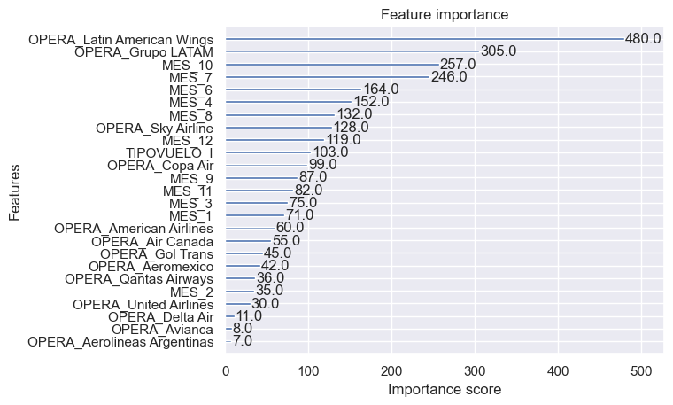
    


```python
top_10_features = [
    "OPERA_Latin American Wings", 
    "MES_7",
    "MES_10",
    "OPERA_Grupo LATAM",
    "MES_12",
    "TIPOVUELO_I",
    "MES_4",
    "MES_11",
    "OPERA_Sky Airline",
    "OPERA_Copa Air"
]
```

### Data Balance


```python
n_y0 = len(y_train[y_train == 0])
n_y1 = len(y_train[y_train == 1])
scale = n_y0/n_y1
print(scale)
```

    4.4402380952380955
    

## 6. Training with Improvement

### 6.a. Data Split


```python
x_train2, x_test2, y_train2, y_test2 = train_test_split(features[top_10_features], target, test_size = 0.33, random_state = 42)
```

### 6.b. Model Selection

#### 6.b.i. XGBoost with Feature Importance and with Balance


```python
xgb_model_2 = xgb.XGBClassifier(random_state=1, learning_rate=0.01, scale_pos_weight = scale)
xgb_model_2.fit(x_train2, y_train2)
```


<style>#sk-container-id-3 {
  /* Definition of color scheme common for light and dark mode */
  --sklearn-color-text: #000;
  --sklearn-color-text-muted: #666;
  --sklearn-color-line: gray;
  /* Definition of color scheme for unfitted estimators */
  --sklearn-color-unfitted-level-0: #fff5e6;
  --sklearn-color-unfitted-level-1: #f6e4d2;
  --sklearn-color-unfitted-level-2: #ffe0b3;
  --sklearn-color-unfitted-level-3: chocolate;
  /* Definition of color scheme for fitted estimators */
  --sklearn-color-fitted-level-0: #f0f8ff;
  --sklearn-color-fitted-level-1: #d4ebff;
  --sklearn-color-fitted-level-2: #b3dbfd;
  --sklearn-color-fitted-level-3: cornflowerblue;

  /* Specific color for light theme */
  --sklearn-color-text-on-default-background: var(--sg-text-color, var(--theme-code-foreground, var(--jp-content-font-color1, black)));
  --sklearn-color-background: var(--sg-background-color, var(--theme-background, var(--jp-layout-color0, white)));
  --sklearn-color-border-box: var(--sg-text-color, var(--theme-code-foreground, var(--jp-content-font-color1, black)));
  --sklearn-color-icon: #696969;

  @media (prefers-color-scheme: dark) {
    /* Redefinition of color scheme for dark theme */
    --sklearn-color-text-on-default-background: var(--sg-text-color, var(--theme-code-foreground, var(--jp-content-font-color1, white)));
    --sklearn-color-background: var(--sg-background-color, var(--theme-background, var(--jp-layout-color0, #111)));
    --sklearn-color-border-box: var(--sg-text-color, var(--theme-code-foreground, var(--jp-content-font-color1, white)));
    --sklearn-color-icon: #878787;
  }
}

#sk-container-id-3 {
  color: var(--sklearn-color-text);
}

#sk-container-id-3 pre {
  padding: 0;
}

#sk-container-id-3 input.sk-hidden--visually {
  border: 0;
  clip: rect(1px 1px 1px 1px);
  clip: rect(1px, 1px, 1px, 1px);
  height: 1px;
  margin: -1px;
  overflow: hidden;
  padding: 0;
  position: absolute;
  width: 1px;
}

#sk-container-id-3 div.sk-dashed-wrapped {
  border: 1px dashed var(--sklearn-color-line);
  margin: 0 0.4em 0.5em 0.4em;
  box-sizing: border-box;
  padding-bottom: 0.4em;
  background-color: var(--sklearn-color-background);
}

#sk-container-id-3 div.sk-container {
  /* jupyter's `normalize.less` sets `[hidden] { display: none; }`
     but bootstrap.min.css set `[hidden] { display: none !important; }`
     so we also need the `!important` here to be able to override the
     default hidden behavior on the sphinx rendered scikit-learn.org.
     See: https://github.com/scikit-learn/scikit-learn/issues/21755 */
  display: inline-block !important;
  position: relative;
}

#sk-container-id-3 div.sk-text-repr-fallback {
  display: none;
}

div.sk-parallel-item,
div.sk-serial,
div.sk-item {
  /* draw centered vertical line to link estimators */
  background-image: linear-gradient(var(--sklearn-color-text-on-default-background), var(--sklearn-color-text-on-default-background));
  background-size: 2px 100%;
  background-repeat: no-repeat;
  background-position: center center;
}

/* Parallel-specific style estimator block */

#sk-container-id-3 div.sk-parallel-item::after {
  content: "";
  width: 100%;
  border-bottom: 2px solid var(--sklearn-color-text-on-default-background);
  flex-grow: 1;
}

#sk-container-id-3 div.sk-parallel {
  display: flex;
  align-items: stretch;
  justify-content: center;
  background-color: var(--sklearn-color-background);
  position: relative;
}

#sk-container-id-3 div.sk-parallel-item {
  display: flex;
  flex-direction: column;
}

#sk-container-id-3 div.sk-parallel-item:first-child::after {
  align-self: flex-end;
  width: 50%;
}

#sk-container-id-3 div.sk-parallel-item:last-child::after {
  align-self: flex-start;
  width: 50%;
}

#sk-container-id-3 div.sk-parallel-item:only-child::after {
  width: 0;
}

/* Serial-specific style estimator block */

#sk-container-id-3 div.sk-serial {
  display: flex;
  flex-direction: column;
  align-items: center;
  background-color: var(--sklearn-color-background);
  padding-right: 1em;
  padding-left: 1em;
}


/* Toggleable style: style used for estimator/Pipeline/ColumnTransformer box that is
clickable and can be expanded/collapsed.
- Pipeline and ColumnTransformer use this feature and define the default style
- Estimators will overwrite some part of the style using the `sk-estimator` class
*/

/* Pipeline and ColumnTransformer style (default) */

#sk-container-id-3 div.sk-toggleable {
  /* Default theme specific background. It is overwritten whether we have a
  specific estimator or a Pipeline/ColumnTransformer */
  background-color: var(--sklearn-color-background);
}

/* Toggleable label */
#sk-container-id-3 label.sk-toggleable__label {
  cursor: pointer;
  display: flex;
  width: 100%;
  margin-bottom: 0;
  padding: 0.5em;
  box-sizing: border-box;
  text-align: center;
  align-items: start;
  justify-content: space-between;
  gap: 0.5em;
}

#sk-container-id-3 label.sk-toggleable__label .caption {
  font-size: 0.6rem;
  font-weight: lighter;
  color: var(--sklearn-color-text-muted);
}

#sk-container-id-3 label.sk-toggleable__label-arrow:before {
  /* Arrow on the left of the label */
  content: "▸";
  float: left;
  margin-right: 0.25em;
  color: var(--sklearn-color-icon);
}

#sk-container-id-3 label.sk-toggleable__label-arrow:hover:before {
  color: var(--sklearn-color-text);
}

/* Toggleable content - dropdown */

#sk-container-id-3 div.sk-toggleable__content {
  display: none;
  text-align: left;
  /* unfitted */
  background-color: var(--sklearn-color-unfitted-level-0);
}

#sk-container-id-3 div.sk-toggleable__content.fitted {
  /* fitted */
  background-color: var(--sklearn-color-fitted-level-0);
}

#sk-container-id-3 div.sk-toggleable__content pre {
  margin: 0.2em;
  border-radius: 0.25em;
  color: var(--sklearn-color-text);
  /* unfitted */
  background-color: var(--sklearn-color-unfitted-level-0);
}

#sk-container-id-3 div.sk-toggleable__content.fitted pre {
  /* unfitted */
  background-color: var(--sklearn-color-fitted-level-0);
}

#sk-container-id-3 input.sk-toggleable__control:checked~div.sk-toggleable__content {
  /* Expand drop-down */
  display: block;
  width: 100%;
  overflow: visible;
}

#sk-container-id-3 input.sk-toggleable__control:checked~label.sk-toggleable__label-arrow:before {
  content: "▾";
}

/* Pipeline/ColumnTransformer-specific style */

#sk-container-id-3 div.sk-label input.sk-toggleable__control:checked~label.sk-toggleable__label {
  color: var(--sklearn-color-text);
  background-color: var(--sklearn-color-unfitted-level-2);
}

#sk-container-id-3 div.sk-label.fitted input.sk-toggleable__control:checked~label.sk-toggleable__label {
  background-color: var(--sklearn-color-fitted-level-2);
}

/* Estimator-specific style */

/* Colorize estimator box */
#sk-container-id-3 div.sk-estimator input.sk-toggleable__control:checked~label.sk-toggleable__label {
  /* unfitted */
  background-color: var(--sklearn-color-unfitted-level-2);
}

#sk-container-id-3 div.sk-estimator.fitted input.sk-toggleable__control:checked~label.sk-toggleable__label {
  /* fitted */
  background-color: var(--sklearn-color-fitted-level-2);
}

#sk-container-id-3 div.sk-label label.sk-toggleable__label,
#sk-container-id-3 div.sk-label label {
  /* The background is the default theme color */
  color: var(--sklearn-color-text-on-default-background);
}

/* On hover, darken the color of the background */
#sk-container-id-3 div.sk-label:hover label.sk-toggleable__label {
  color: var(--sklearn-color-text);
  background-color: var(--sklearn-color-unfitted-level-2);
}

/* Label box, darken color on hover, fitted */
#sk-container-id-3 div.sk-label.fitted:hover label.sk-toggleable__label.fitted {
  color: var(--sklearn-color-text);
  background-color: var(--sklearn-color-fitted-level-2);
}

/* Estimator label */

#sk-container-id-3 div.sk-label label {
  font-family: monospace;
  font-weight: bold;
  display: inline-block;
  line-height: 1.2em;
}

#sk-container-id-3 div.sk-label-container {
  text-align: center;
}

/* Estimator-specific */
#sk-container-id-3 div.sk-estimator {
  font-family: monospace;
  border: 1px dotted var(--sklearn-color-border-box);
  border-radius: 0.25em;
  box-sizing: border-box;
  margin-bottom: 0.5em;
  /* unfitted */
  background-color: var(--sklearn-color-unfitted-level-0);
}

#sk-container-id-3 div.sk-estimator.fitted {
  /* fitted */
  background-color: var(--sklearn-color-fitted-level-0);
}

/* on hover */
#sk-container-id-3 div.sk-estimator:hover {
  /* unfitted */
  background-color: var(--sklearn-color-unfitted-level-2);
}

#sk-container-id-3 div.sk-estimator.fitted:hover {
  /* fitted */
  background-color: var(--sklearn-color-fitted-level-2);
}

/* Specification for estimator info (e.g. "i" and "?") */

/* Common style for "i" and "?" */

.sk-estimator-doc-link,
a:link.sk-estimator-doc-link,
a:visited.sk-estimator-doc-link {
  float: right;
  font-size: smaller;
  line-height: 1em;
  font-family: monospace;
  background-color: var(--sklearn-color-background);
  border-radius: 1em;
  height: 1em;
  width: 1em;
  text-decoration: none !important;
  margin-left: 0.5em;
  text-align: center;
  /* unfitted */
  border: var(--sklearn-color-unfitted-level-1) 1pt solid;
  color: var(--sklearn-color-unfitted-level-1);
}

.sk-estimator-doc-link.fitted,
a:link.sk-estimator-doc-link.fitted,
a:visited.sk-estimator-doc-link.fitted {
  /* fitted */
  border: var(--sklearn-color-fitted-level-1) 1pt solid;
  color: var(--sklearn-color-fitted-level-1);
}

/* On hover */
div.sk-estimator:hover .sk-estimator-doc-link:hover,
.sk-estimator-doc-link:hover,
div.sk-label-container:hover .sk-estimator-doc-link:hover,
.sk-estimator-doc-link:hover {
  /* unfitted */
  background-color: var(--sklearn-color-unfitted-level-3);
  color: var(--sklearn-color-background);
  text-decoration: none;
}

div.sk-estimator.fitted:hover .sk-estimator-doc-link.fitted:hover,
.sk-estimator-doc-link.fitted:hover,
div.sk-label-container:hover .sk-estimator-doc-link.fitted:hover,
.sk-estimator-doc-link.fitted:hover {
  /* fitted */
  background-color: var(--sklearn-color-fitted-level-3);
  color: var(--sklearn-color-background);
  text-decoration: none;
}

/* Span, style for the box shown on hovering the info icon */
.sk-estimator-doc-link span {
  display: none;
  z-index: 9999;
  position: relative;
  font-weight: normal;
  right: .2ex;
  padding: .5ex;
  margin: .5ex;
  width: min-content;
  min-width: 20ex;
  max-width: 50ex;
  color: var(--sklearn-color-text);
  box-shadow: 2pt 2pt 4pt #999;
  /* unfitted */
  background: var(--sklearn-color-unfitted-level-0);
  border: .5pt solid var(--sklearn-color-unfitted-level-3);
}

.sk-estimator-doc-link.fitted span {
  /* fitted */
  background: var(--sklearn-color-fitted-level-0);
  border: var(--sklearn-color-fitted-level-3);
}

.sk-estimator-doc-link:hover span {
  display: block;
}

/* "?"-specific style due to the `<a>` HTML tag */

#sk-container-id-3 a.estimator_doc_link {
  float: right;
  font-size: 1rem;
  line-height: 1em;
  font-family: monospace;
  background-color: var(--sklearn-color-background);
  border-radius: 1rem;
  height: 1rem;
  width: 1rem;
  text-decoration: none;
  /* unfitted */
  color: var(--sklearn-color-unfitted-level-1);
  border: var(--sklearn-color-unfitted-level-1) 1pt solid;
}

#sk-container-id-3 a.estimator_doc_link.fitted {
  /* fitted */
  border: var(--sklearn-color-fitted-level-1) 1pt solid;
  color: var(--sklearn-color-fitted-level-1);
}

/* On hover */
#sk-container-id-3 a.estimator_doc_link:hover {
  /* unfitted */
  background-color: var(--sklearn-color-unfitted-level-3);
  color: var(--sklearn-color-background);
  text-decoration: none;
}

#sk-container-id-3 a.estimator_doc_link.fitted:hover {
  /* fitted */
  background-color: var(--sklearn-color-fitted-level-3);
}

.estimator-table summary {
    padding: .5rem;
    font-family: monospace;
    cursor: pointer;
}

.estimator-table details[open] {
    padding-left: 0.1rem;
    padding-right: 0.1rem;
    padding-bottom: 0.3rem;
}

.estimator-table .parameters-table {
    margin-left: auto !important;
    margin-right: auto !important;
}

.estimator-table .parameters-table tr:nth-child(odd) {
    background-color: #fff;
}

.estimator-table .parameters-table tr:nth-child(even) {
    background-color: #f6f6f6;
}

.estimator-table .parameters-table tr:hover {
    background-color: #e0e0e0;
}

.estimator-table table td {
    border: 1px solid rgba(106, 105, 104, 0.232);
}

.user-set td {
    color:rgb(255, 94, 0);
    text-align: left;
}

.user-set td.value pre {
    color:rgb(255, 94, 0) !important;
    background-color: transparent !important;
}

.default td {
    color: black;
    text-align: left;
}

.user-set td i,
.default td i {
    color: black;
}

.copy-paste-icon {
    background-image: url(data:image/svg+xml;base64,PHN2ZyB4bWxucz0iaHR0cDovL3d3dy53My5vcmcvMjAwMC9zdmciIHZpZXdCb3g9IjAgMCA0NDggNTEyIj48IS0tIUZvbnQgQXdlc29tZSBGcmVlIDYuNy4yIGJ5IEBmb250YXdlc29tZSAtIGh0dHBzOi8vZm9udGF3ZXNvbWUuY29tIExpY2Vuc2UgLSBodHRwczovL2ZvbnRhd2Vzb21lLmNvbS9saWNlbnNlL2ZyZWUgQ29weXJpZ2h0IDIwMjUgRm9udGljb25zLCBJbmMuLS0+PHBhdGggZD0iTTIwOCAwTDMzMi4xIDBjMTIuNyAwIDI0LjkgNS4xIDMzLjkgMTQuMWw2Ny45IDY3LjljOSA5IDE0LjEgMjEuMiAxNC4xIDMzLjlMNDQ4IDMzNmMwIDI2LjUtMjEuNSA0OC00OCA0OGwtMTkyIDBjLTI2LjUgMC00OC0yMS41LTQ4LTQ4bDAtMjg4YzAtMjYuNSAyMS41LTQ4IDQ4LTQ4ek00OCAxMjhsODAgMCAwIDY0LTY0IDAgMCAyNTYgMTkyIDAgMC0zMiA2NCAwIDAgNDhjMCAyNi41LTIxLjUgNDgtNDggNDhMNDggNTEyYy0yNi41IDAtNDgtMjEuNS00OC00OEwwIDE3NmMwLTI2LjUgMjEuNS00OCA0OC00OHoiLz48L3N2Zz4=);
    background-repeat: no-repeat;
    background-size: 14px 14px;
    background-position: 0;
    display: inline-block;
    width: 14px;
    height: 14px;
    cursor: pointer;
}
</style><body><div id="sk-container-id-3" class="sk-top-container"><div class="sk-text-repr-fallback"><pre>XGBClassifier(base_score=None, booster=None, callbacks=None,
              colsample_bylevel=None, colsample_bynode=None,
              colsample_bytree=None, device=None, early_stopping_rounds=None,
              enable_categorical=False, eval_metric=None, feature_types=None,
              feature_weights=None, gamma=None, grow_policy=None,
              importance_type=None, interaction_constraints=None,
              learning_rate=0.01, max_bin=None, max_cat_threshold=None,
              max_cat_to_onehot=None, max_delta_step=None, max_depth=None,
              max_leaves=None, min_child_weight=None, missing=nan,
              monotone_constraints=None, multi_strategy=None, n_estimators=None,
              n_jobs=None, num_parallel_tree=None, ...)</pre><b>In a Jupyter environment, please rerun this cell to show the HTML representation or trust the notebook. <br />On GitHub, the HTML representation is unable to render, please try loading this page with nbviewer.org.</b></div><div class="sk-container" hidden><div class="sk-item"><div class="sk-estimator fitted sk-toggleable"><input class="sk-toggleable__control sk-hidden--visually" id="sk-estimator-id-3" type="checkbox" checked><label for="sk-estimator-id-3" class="sk-toggleable__label fitted sk-toggleable__label-arrow"><div><div>XGBClassifier</div></div><div><a class="sk-estimator-doc-link fitted" rel="noreferrer" target="_blank" href="https://xgboost.readthedocs.io/en/release_3.0.0/python/python_api.html#xgboost.XGBClassifier">?<span>Documentation for XGBClassifier</span></a><span class="sk-estimator-doc-link fitted">i<span>Fitted</span></span></div></label><div class="sk-toggleable__content fitted" data-param-prefix="">
        <div class="estimator-table">
            <details>
                <summary>Parameters</summary>
                <table class="parameters-table">
                  <tbody>

        <tr class="default">
            <td><i class="copy-paste-icon"
                 onclick="copyToClipboard('objective',
                          this.parentElement.nextElementSibling)"
            ></i></td>
            <td class="param">objective&nbsp;</td>
            <td class="value">&#x27;binary:logistic&#x27;</td>
        </tr>


        <tr class="user-set">
            <td><i class="copy-paste-icon"
                 onclick="copyToClipboard('base_score',
                          this.parentElement.nextElementSibling)"
            ></i></td>
            <td class="param">base_score&nbsp;</td>
            <td class="value">None</td>
        </tr>


        <tr class="user-set">
            <td><i class="copy-paste-icon"
                 onclick="copyToClipboard('booster',
                          this.parentElement.nextElementSibling)"
            ></i></td>
            <td class="param">booster&nbsp;</td>
            <td class="value">None</td>
        </tr>


        <tr class="user-set">
            <td><i class="copy-paste-icon"
                 onclick="copyToClipboard('callbacks',
                          this.parentElement.nextElementSibling)"
            ></i></td>
            <td class="param">callbacks&nbsp;</td>
            <td class="value">None</td>
        </tr>


        <tr class="user-set">
            <td><i class="copy-paste-icon"
                 onclick="copyToClipboard('colsample_bylevel',
                          this.parentElement.nextElementSibling)"
            ></i></td>
            <td class="param">colsample_bylevel&nbsp;</td>
            <td class="value">None</td>
        </tr>


        <tr class="user-set">
            <td><i class="copy-paste-icon"
                 onclick="copyToClipboard('colsample_bynode',
                          this.parentElement.nextElementSibling)"
            ></i></td>
            <td class="param">colsample_bynode&nbsp;</td>
            <td class="value">None</td>
        </tr>


        <tr class="user-set">
            <td><i class="copy-paste-icon"
                 onclick="copyToClipboard('colsample_bytree',
                          this.parentElement.nextElementSibling)"
            ></i></td>
            <td class="param">colsample_bytree&nbsp;</td>
            <td class="value">None</td>
        </tr>


        <tr class="user-set">
            <td><i class="copy-paste-icon"
                 onclick="copyToClipboard('device',
                          this.parentElement.nextElementSibling)"
            ></i></td>
            <td class="param">device&nbsp;</td>
            <td class="value">None</td>
        </tr>


        <tr class="user-set">
            <td><i class="copy-paste-icon"
                 onclick="copyToClipboard('early_stopping_rounds',
                          this.parentElement.nextElementSibling)"
            ></i></td>
            <td class="param">early_stopping_rounds&nbsp;</td>
            <td class="value">None</td>
        </tr>


        <tr class="user-set">
            <td><i class="copy-paste-icon"
                 onclick="copyToClipboard('enable_categorical',
                          this.parentElement.nextElementSibling)"
            ></i></td>
            <td class="param">enable_categorical&nbsp;</td>
            <td class="value">False</td>
        </tr>


        <tr class="user-set">
            <td><i class="copy-paste-icon"
                 onclick="copyToClipboard('eval_metric',
                          this.parentElement.nextElementSibling)"
            ></i></td>
            <td class="param">eval_metric&nbsp;</td>
            <td class="value">None</td>
        </tr>


        <tr class="user-set">
            <td><i class="copy-paste-icon"
                 onclick="copyToClipboard('feature_types',
                          this.parentElement.nextElementSibling)"
            ></i></td>
            <td class="param">feature_types&nbsp;</td>
            <td class="value">None</td>
        </tr>


        <tr class="user-set">
            <td><i class="copy-paste-icon"
                 onclick="copyToClipboard('feature_weights',
                          this.parentElement.nextElementSibling)"
            ></i></td>
            <td class="param">feature_weights&nbsp;</td>
            <td class="value">None</td>
        </tr>


        <tr class="user-set">
            <td><i class="copy-paste-icon"
                 onclick="copyToClipboard('gamma',
                          this.parentElement.nextElementSibling)"
            ></i></td>
            <td class="param">gamma&nbsp;</td>
            <td class="value">None</td>
        </tr>


        <tr class="user-set">
            <td><i class="copy-paste-icon"
                 onclick="copyToClipboard('grow_policy',
                          this.parentElement.nextElementSibling)"
            ></i></td>
            <td class="param">grow_policy&nbsp;</td>
            <td class="value">None</td>
        </tr>


        <tr class="user-set">
            <td><i class="copy-paste-icon"
                 onclick="copyToClipboard('importance_type',
                          this.parentElement.nextElementSibling)"
            ></i></td>
            <td class="param">importance_type&nbsp;</td>
            <td class="value">None</td>
        </tr>


        <tr class="user-set">
            <td><i class="copy-paste-icon"
                 onclick="copyToClipboard('interaction_constraints',
                          this.parentElement.nextElementSibling)"
            ></i></td>
            <td class="param">interaction_constraints&nbsp;</td>
            <td class="value">None</td>
        </tr>


        <tr class="user-set">
            <td><i class="copy-paste-icon"
                 onclick="copyToClipboard('learning_rate',
                          this.parentElement.nextElementSibling)"
            ></i></td>
            <td class="param">learning_rate&nbsp;</td>
            <td class="value">0.01</td>
        </tr>


        <tr class="user-set">
            <td><i class="copy-paste-icon"
                 onclick="copyToClipboard('max_bin',
                          this.parentElement.nextElementSibling)"
            ></i></td>
            <td class="param">max_bin&nbsp;</td>
            <td class="value">None</td>
        </tr>


        <tr class="user-set">
            <td><i class="copy-paste-icon"
                 onclick="copyToClipboard('max_cat_threshold',
                          this.parentElement.nextElementSibling)"
            ></i></td>
            <td class="param">max_cat_threshold&nbsp;</td>
            <td class="value">None</td>
        </tr>


        <tr class="user-set">
            <td><i class="copy-paste-icon"
                 onclick="copyToClipboard('max_cat_to_onehot',
                          this.parentElement.nextElementSibling)"
            ></i></td>
            <td class="param">max_cat_to_onehot&nbsp;</td>
            <td class="value">None</td>
        </tr>


        <tr class="user-set">
            <td><i class="copy-paste-icon"
                 onclick="copyToClipboard('max_delta_step',
                          this.parentElement.nextElementSibling)"
            ></i></td>
            <td class="param">max_delta_step&nbsp;</td>
            <td class="value">None</td>
        </tr>


        <tr class="user-set">
            <td><i class="copy-paste-icon"
                 onclick="copyToClipboard('max_depth',
                          this.parentElement.nextElementSibling)"
            ></i></td>
            <td class="param">max_depth&nbsp;</td>
            <td class="value">None</td>
        </tr>


        <tr class="user-set">
            <td><i class="copy-paste-icon"
                 onclick="copyToClipboard('max_leaves',
                          this.parentElement.nextElementSibling)"
            ></i></td>
            <td class="param">max_leaves&nbsp;</td>
            <td class="value">None</td>
        </tr>


        <tr class="user-set">
            <td><i class="copy-paste-icon"
                 onclick="copyToClipboard('min_child_weight',
                          this.parentElement.nextElementSibling)"
            ></i></td>
            <td class="param">min_child_weight&nbsp;</td>
            <td class="value">None</td>
        </tr>


        <tr class="user-set">
            <td><i class="copy-paste-icon"
                 onclick="copyToClipboard('missing',
                          this.parentElement.nextElementSibling)"
            ></i></td>
            <td class="param">missing&nbsp;</td>
            <td class="value">nan</td>
        </tr>


        <tr class="user-set">
            <td><i class="copy-paste-icon"
                 onclick="copyToClipboard('monotone_constraints',
                          this.parentElement.nextElementSibling)"
            ></i></td>
            <td class="param">monotone_constraints&nbsp;</td>
            <td class="value">None</td>
        </tr>


        <tr class="user-set">
            <td><i class="copy-paste-icon"
                 onclick="copyToClipboard('multi_strategy',
                          this.parentElement.nextElementSibling)"
            ></i></td>
            <td class="param">multi_strategy&nbsp;</td>
            <td class="value">None</td>
        </tr>


        <tr class="user-set">
            <td><i class="copy-paste-icon"
                 onclick="copyToClipboard('n_estimators',
                          this.parentElement.nextElementSibling)"
            ></i></td>
            <td class="param">n_estimators&nbsp;</td>
            <td class="value">None</td>
        </tr>


        <tr class="user-set">
            <td><i class="copy-paste-icon"
                 onclick="copyToClipboard('n_jobs',
                          this.parentElement.nextElementSibling)"
            ></i></td>
            <td class="param">n_jobs&nbsp;</td>
            <td class="value">None</td>
        </tr>


        <tr class="user-set">
            <td><i class="copy-paste-icon"
                 onclick="copyToClipboard('num_parallel_tree',
                          this.parentElement.nextElementSibling)"
            ></i></td>
            <td class="param">num_parallel_tree&nbsp;</td>
            <td class="value">None</td>
        </tr>


        <tr class="user-set">
            <td><i class="copy-paste-icon"
                 onclick="copyToClipboard('random_state',
                          this.parentElement.nextElementSibling)"
            ></i></td>
            <td class="param">random_state&nbsp;</td>
            <td class="value">1</td>
        </tr>


        <tr class="user-set">
            <td><i class="copy-paste-icon"
                 onclick="copyToClipboard('reg_alpha',
                          this.parentElement.nextElementSibling)"
            ></i></td>
            <td class="param">reg_alpha&nbsp;</td>
            <td class="value">None</td>
        </tr>


        <tr class="user-set">
            <td><i class="copy-paste-icon"
                 onclick="copyToClipboard('reg_lambda',
                          this.parentElement.nextElementSibling)"
            ></i></td>
            <td class="param">reg_lambda&nbsp;</td>
            <td class="value">None</td>
        </tr>


        <tr class="user-set">
            <td><i class="copy-paste-icon"
                 onclick="copyToClipboard('sampling_method',
                          this.parentElement.nextElementSibling)"
            ></i></td>
            <td class="param">sampling_method&nbsp;</td>
            <td class="value">None</td>
        </tr>


        <tr class="user-set">
            <td><i class="copy-paste-icon"
                 onclick="copyToClipboard('scale_pos_weight',
                          this.parentElement.nextElementSibling)"
            ></i></td>
            <td class="param">scale_pos_weight&nbsp;</td>
            <td class="value">4.4402380952380955</td>
        </tr>


        <tr class="user-set">
            <td><i class="copy-paste-icon"
                 onclick="copyToClipboard('subsample',
                          this.parentElement.nextElementSibling)"
            ></i></td>
            <td class="param">subsample&nbsp;</td>
            <td class="value">None</td>
        </tr>


        <tr class="user-set">
            <td><i class="copy-paste-icon"
                 onclick="copyToClipboard('tree_method',
                          this.parentElement.nextElementSibling)"
            ></i></td>
            <td class="param">tree_method&nbsp;</td>
            <td class="value">None</td>
        </tr>


        <tr class="user-set">
            <td><i class="copy-paste-icon"
                 onclick="copyToClipboard('validate_parameters',
                          this.parentElement.nextElementSibling)"
            ></i></td>
            <td class="param">validate_parameters&nbsp;</td>
            <td class="value">None</td>
        </tr>


        <tr class="user-set">
            <td><i class="copy-paste-icon"
                 onclick="copyToClipboard('verbosity',
                          this.parentElement.nextElementSibling)"
            ></i></td>
            <td class="param">verbosity&nbsp;</td>
            <td class="value">None</td>
        </tr>

                  </tbody>
                </table>
            </details>
        </div>
    </div></div></div></div></div><script>function copyToClipboard(text, element) {
    // Get the parameter prefix from the closest toggleable content
    const toggleableContent = element.closest('.sk-toggleable__content');
    const paramPrefix = toggleableContent ? toggleableContent.dataset.paramPrefix : '';
    const fullParamName = paramPrefix ? `${paramPrefix}${text}` : text;

    const originalStyle = element.style;
    const computedStyle = window.getComputedStyle(element);
    const originalWidth = computedStyle.width;
    const originalHTML = element.innerHTML.replace('Copied!', '');

    navigator.clipboard.writeText(fullParamName)
        .then(() => {
            element.style.width = originalWidth;
            element.style.color = 'green';
            element.innerHTML = "Copied!";

            setTimeout(() => {
                element.innerHTML = originalHTML;
                element.style = originalStyle;
            }, 2000);
        })
        .catch(err => {
            console.error('Failed to copy:', err);
            element.style.color = 'red';
            element.innerHTML = "Failed!";
            setTimeout(() => {
                element.innerHTML = originalHTML;
                element.style = originalStyle;
            }, 2000);
        });
    return false;
}

document.querySelectorAll('.fa-regular.fa-copy').forEach(function(element) {
    const toggleableContent = element.closest('.sk-toggleable__content');
    const paramPrefix = toggleableContent ? toggleableContent.dataset.paramPrefix : '';
    const paramName = element.parentElement.nextElementSibling.textContent.trim();
    const fullParamName = paramPrefix ? `${paramPrefix}${paramName}` : paramName;

    element.setAttribute('title', fullParamName);
});
</script></body>


```python
xgboost_y_preds_2 = xgb_model_2.predict(x_test2)
```


```python
confusion_matrix(y_test2, xgboost_y_preds_2)
```


    array([[9556, 8738],
           [1313, 2901]])


```python
print(classification_report(y_test2, xgboost_y_preds_2))
```

                  precision    recall  f1-score   support
    
               0       0.88      0.52      0.66     18294
               1       0.25      0.69      0.37      4214
    
        accuracy                           0.55     22508
       macro avg       0.56      0.61      0.51     22508
    weighted avg       0.76      0.55      0.60     22508
    
    

#### 6.b.ii. XGBoost with Feature Importance but without Balance


```python
xgb_model_3 = xgb.XGBClassifier(random_state=1, learning_rate=0.01)
xgb_model_3.fit(x_train2, y_train2)
```


<style>#sk-container-id-4 {
  /* Definition of color scheme common for light and dark mode */
  --sklearn-color-text: #000;
  --sklearn-color-text-muted: #666;
  --sklearn-color-line: gray;
  /* Definition of color scheme for unfitted estimators */
  --sklearn-color-unfitted-level-0: #fff5e6;
  --sklearn-color-unfitted-level-1: #f6e4d2;
  --sklearn-color-unfitted-level-2: #ffe0b3;
  --sklearn-color-unfitted-level-3: chocolate;
  /* Definition of color scheme for fitted estimators */
  --sklearn-color-fitted-level-0: #f0f8ff;
  --sklearn-color-fitted-level-1: #d4ebff;
  --sklearn-color-fitted-level-2: #b3dbfd;
  --sklearn-color-fitted-level-3: cornflowerblue;

  /* Specific color for light theme */
  --sklearn-color-text-on-default-background: var(--sg-text-color, var(--theme-code-foreground, var(--jp-content-font-color1, black)));
  --sklearn-color-background: var(--sg-background-color, var(--theme-background, var(--jp-layout-color0, white)));
  --sklearn-color-border-box: var(--sg-text-color, var(--theme-code-foreground, var(--jp-content-font-color1, black)));
  --sklearn-color-icon: #696969;

  @media (prefers-color-scheme: dark) {
    /* Redefinition of color scheme for dark theme */
    --sklearn-color-text-on-default-background: var(--sg-text-color, var(--theme-code-foreground, var(--jp-content-font-color1, white)));
    --sklearn-color-background: var(--sg-background-color, var(--theme-background, var(--jp-layout-color0, #111)));
    --sklearn-color-border-box: var(--sg-text-color, var(--theme-code-foreground, var(--jp-content-font-color1, white)));
    --sklearn-color-icon: #878787;
  }
}

#sk-container-id-4 {
  color: var(--sklearn-color-text);
}

#sk-container-id-4 pre {
  padding: 0;
}

#sk-container-id-4 input.sk-hidden--visually {
  border: 0;
  clip: rect(1px 1px 1px 1px);
  clip: rect(1px, 1px, 1px, 1px);
  height: 1px;
  margin: -1px;
  overflow: hidden;
  padding: 0;
  position: absolute;
  width: 1px;
}

#sk-container-id-4 div.sk-dashed-wrapped {
  border: 1px dashed var(--sklearn-color-line);
  margin: 0 0.4em 0.5em 0.4em;
  box-sizing: border-box;
  padding-bottom: 0.4em;
  background-color: var(--sklearn-color-background);
}

#sk-container-id-4 div.sk-container {
  /* jupyter's `normalize.less` sets `[hidden] { display: none; }`
     but bootstrap.min.css set `[hidden] { display: none !important; }`
     so we also need the `!important` here to be able to override the
     default hidden behavior on the sphinx rendered scikit-learn.org.
     See: https://github.com/scikit-learn/scikit-learn/issues/21755 */
  display: inline-block !important;
  position: relative;
}

#sk-container-id-4 div.sk-text-repr-fallback {
  display: none;
}

div.sk-parallel-item,
div.sk-serial,
div.sk-item {
  /* draw centered vertical line to link estimators */
  background-image: linear-gradient(var(--sklearn-color-text-on-default-background), var(--sklearn-color-text-on-default-background));
  background-size: 2px 100%;
  background-repeat: no-repeat;
  background-position: center center;
}

/* Parallel-specific style estimator block */

#sk-container-id-4 div.sk-parallel-item::after {
  content: "";
  width: 100%;
  border-bottom: 2px solid var(--sklearn-color-text-on-default-background);
  flex-grow: 1;
}

#sk-container-id-4 div.sk-parallel {
  display: flex;
  align-items: stretch;
  justify-content: center;
  background-color: var(--sklearn-color-background);
  position: relative;
}

#sk-container-id-4 div.sk-parallel-item {
  display: flex;
  flex-direction: column;
}

#sk-container-id-4 div.sk-parallel-item:first-child::after {
  align-self: flex-end;
  width: 50%;
}

#sk-container-id-4 div.sk-parallel-item:last-child::after {
  align-self: flex-start;
  width: 50%;
}

#sk-container-id-4 div.sk-parallel-item:only-child::after {
  width: 0;
}

/* Serial-specific style estimator block */

#sk-container-id-4 div.sk-serial {
  display: flex;
  flex-direction: column;
  align-items: center;
  background-color: var(--sklearn-color-background);
  padding-right: 1em;
  padding-left: 1em;
}


/* Toggleable style: style used for estimator/Pipeline/ColumnTransformer box that is
clickable and can be expanded/collapsed.
- Pipeline and ColumnTransformer use this feature and define the default style
- Estimators will overwrite some part of the style using the `sk-estimator` class
*/

/* Pipeline and ColumnTransformer style (default) */

#sk-container-id-4 div.sk-toggleable {
  /* Default theme specific background. It is overwritten whether we have a
  specific estimator or a Pipeline/ColumnTransformer */
  background-color: var(--sklearn-color-background);
}

/* Toggleable label */
#sk-container-id-4 label.sk-toggleable__label {
  cursor: pointer;
  display: flex;
  width: 100%;
  margin-bottom: 0;
  padding: 0.5em;
  box-sizing: border-box;
  text-align: center;
  align-items: start;
  justify-content: space-between;
  gap: 0.5em;
}

#sk-container-id-4 label.sk-toggleable__label .caption {
  font-size: 0.6rem;
  font-weight: lighter;
  color: var(--sklearn-color-text-muted);
}

#sk-container-id-4 label.sk-toggleable__label-arrow:before {
  /* Arrow on the left of the label */
  content: "▸";
  float: left;
  margin-right: 0.25em;
  color: var(--sklearn-color-icon);
}

#sk-container-id-4 label.sk-toggleable__label-arrow:hover:before {
  color: var(--sklearn-color-text);
}

/* Toggleable content - dropdown */

#sk-container-id-4 div.sk-toggleable__content {
  display: none;
  text-align: left;
  /* unfitted */
  background-color: var(--sklearn-color-unfitted-level-0);
}

#sk-container-id-4 div.sk-toggleable__content.fitted {
  /* fitted */
  background-color: var(--sklearn-color-fitted-level-0);
}

#sk-container-id-4 div.sk-toggleable__content pre {
  margin: 0.2em;
  border-radius: 0.25em;
  color: var(--sklearn-color-text);
  /* unfitted */
  background-color: var(--sklearn-color-unfitted-level-0);
}

#sk-container-id-4 div.sk-toggleable__content.fitted pre {
  /* unfitted */
  background-color: var(--sklearn-color-fitted-level-0);
}

#sk-container-id-4 input.sk-toggleable__control:checked~div.sk-toggleable__content {
  /* Expand drop-down */
  display: block;
  width: 100%;
  overflow: visible;
}

#sk-container-id-4 input.sk-toggleable__control:checked~label.sk-toggleable__label-arrow:before {
  content: "▾";
}

/* Pipeline/ColumnTransformer-specific style */

#sk-container-id-4 div.sk-label input.sk-toggleable__control:checked~label.sk-toggleable__label {
  color: var(--sklearn-color-text);
  background-color: var(--sklearn-color-unfitted-level-2);
}

#sk-container-id-4 div.sk-label.fitted input.sk-toggleable__control:checked~label.sk-toggleable__label {
  background-color: var(--sklearn-color-fitted-level-2);
}

/* Estimator-specific style */

/* Colorize estimator box */
#sk-container-id-4 div.sk-estimator input.sk-toggleable__control:checked~label.sk-toggleable__label {
  /* unfitted */
  background-color: var(--sklearn-color-unfitted-level-2);
}

#sk-container-id-4 div.sk-estimator.fitted input.sk-toggleable__control:checked~label.sk-toggleable__label {
  /* fitted */
  background-color: var(--sklearn-color-fitted-level-2);
}

#sk-container-id-4 div.sk-label label.sk-toggleable__label,
#sk-container-id-4 div.sk-label label {
  /* The background is the default theme color */
  color: var(--sklearn-color-text-on-default-background);
}

/* On hover, darken the color of the background */
#sk-container-id-4 div.sk-label:hover label.sk-toggleable__label {
  color: var(--sklearn-color-text);
  background-color: var(--sklearn-color-unfitted-level-2);
}

/* Label box, darken color on hover, fitted */
#sk-container-id-4 div.sk-label.fitted:hover label.sk-toggleable__label.fitted {
  color: var(--sklearn-color-text);
  background-color: var(--sklearn-color-fitted-level-2);
}

/* Estimator label */

#sk-container-id-4 div.sk-label label {
  font-family: monospace;
  font-weight: bold;
  display: inline-block;
  line-height: 1.2em;
}

#sk-container-id-4 div.sk-label-container {
  text-align: center;
}

/* Estimator-specific */
#sk-container-id-4 div.sk-estimator {
  font-family: monospace;
  border: 1px dotted var(--sklearn-color-border-box);
  border-radius: 0.25em;
  box-sizing: border-box;
  margin-bottom: 0.5em;
  /* unfitted */
  background-color: var(--sklearn-color-unfitted-level-0);
}

#sk-container-id-4 div.sk-estimator.fitted {
  /* fitted */
  background-color: var(--sklearn-color-fitted-level-0);
}

/* on hover */
#sk-container-id-4 div.sk-estimator:hover {
  /* unfitted */
  background-color: var(--sklearn-color-unfitted-level-2);
}

#sk-container-id-4 div.sk-estimator.fitted:hover {
  /* fitted */
  background-color: var(--sklearn-color-fitted-level-2);
}

/* Specification for estimator info (e.g. "i" and "?") */

/* Common style for "i" and "?" */

.sk-estimator-doc-link,
a:link.sk-estimator-doc-link,
a:visited.sk-estimator-doc-link {
  float: right;
  font-size: smaller;
  line-height: 1em;
  font-family: monospace;
  background-color: var(--sklearn-color-background);
  border-radius: 1em;
  height: 1em;
  width: 1em;
  text-decoration: none !important;
  margin-left: 0.5em;
  text-align: center;
  /* unfitted */
  border: var(--sklearn-color-unfitted-level-1) 1pt solid;
  color: var(--sklearn-color-unfitted-level-1);
}

.sk-estimator-doc-link.fitted,
a:link.sk-estimator-doc-link.fitted,
a:visited.sk-estimator-doc-link.fitted {
  /* fitted */
  border: var(--sklearn-color-fitted-level-1) 1pt solid;
  color: var(--sklearn-color-fitted-level-1);
}

/* On hover */
div.sk-estimator:hover .sk-estimator-doc-link:hover,
.sk-estimator-doc-link:hover,
div.sk-label-container:hover .sk-estimator-doc-link:hover,
.sk-estimator-doc-link:hover {
  /* unfitted */
  background-color: var(--sklearn-color-unfitted-level-3);
  color: var(--sklearn-color-background);
  text-decoration: none;
}

div.sk-estimator.fitted:hover .sk-estimator-doc-link.fitted:hover,
.sk-estimator-doc-link.fitted:hover,
div.sk-label-container:hover .sk-estimator-doc-link.fitted:hover,
.sk-estimator-doc-link.fitted:hover {
  /* fitted */
  background-color: var(--sklearn-color-fitted-level-3);
  color: var(--sklearn-color-background);
  text-decoration: none;
}

/* Span, style for the box shown on hovering the info icon */
.sk-estimator-doc-link span {
  display: none;
  z-index: 9999;
  position: relative;
  font-weight: normal;
  right: .2ex;
  padding: .5ex;
  margin: .5ex;
  width: min-content;
  min-width: 20ex;
  max-width: 50ex;
  color: var(--sklearn-color-text);
  box-shadow: 2pt 2pt 4pt #999;
  /* unfitted */
  background: var(--sklearn-color-unfitted-level-0);
  border: .5pt solid var(--sklearn-color-unfitted-level-3);
}

.sk-estimator-doc-link.fitted span {
  /* fitted */
  background: var(--sklearn-color-fitted-level-0);
  border: var(--sklearn-color-fitted-level-3);
}

.sk-estimator-doc-link:hover span {
  display: block;
}

/* "?"-specific style due to the `<a>` HTML tag */

#sk-container-id-4 a.estimator_doc_link {
  float: right;
  font-size: 1rem;
  line-height: 1em;
  font-family: monospace;
  background-color: var(--sklearn-color-background);
  border-radius: 1rem;
  height: 1rem;
  width: 1rem;
  text-decoration: none;
  /* unfitted */
  color: var(--sklearn-color-unfitted-level-1);
  border: var(--sklearn-color-unfitted-level-1) 1pt solid;
}

#sk-container-id-4 a.estimator_doc_link.fitted {
  /* fitted */
  border: var(--sklearn-color-fitted-level-1) 1pt solid;
  color: var(--sklearn-color-fitted-level-1);
}

/* On hover */
#sk-container-id-4 a.estimator_doc_link:hover {
  /* unfitted */
  background-color: var(--sklearn-color-unfitted-level-3);
  color: var(--sklearn-color-background);
  text-decoration: none;
}

#sk-container-id-4 a.estimator_doc_link.fitted:hover {
  /* fitted */
  background-color: var(--sklearn-color-fitted-level-3);
}

.estimator-table summary {
    padding: .5rem;
    font-family: monospace;
    cursor: pointer;
}

.estimator-table details[open] {
    padding-left: 0.1rem;
    padding-right: 0.1rem;
    padding-bottom: 0.3rem;
}

.estimator-table .parameters-table {
    margin-left: auto !important;
    margin-right: auto !important;
}

.estimator-table .parameters-table tr:nth-child(odd) {
    background-color: #fff;
}

.estimator-table .parameters-table tr:nth-child(even) {
    background-color: #f6f6f6;
}

.estimator-table .parameters-table tr:hover {
    background-color: #e0e0e0;
}

.estimator-table table td {
    border: 1px solid rgba(106, 105, 104, 0.232);
}

.user-set td {
    color:rgb(255, 94, 0);
    text-align: left;
}

.user-set td.value pre {
    color:rgb(255, 94, 0) !important;
    background-color: transparent !important;
}

.default td {
    color: black;
    text-align: left;
}

.user-set td i,
.default td i {
    color: black;
}

.copy-paste-icon {
    background-image: url(data:image/svg+xml;base64,PHN2ZyB4bWxucz0iaHR0cDovL3d3dy53My5vcmcvMjAwMC9zdmciIHZpZXdCb3g9IjAgMCA0NDggNTEyIj48IS0tIUZvbnQgQXdlc29tZSBGcmVlIDYuNy4yIGJ5IEBmb250YXdlc29tZSAtIGh0dHBzOi8vZm9udGF3ZXNvbWUuY29tIExpY2Vuc2UgLSBodHRwczovL2ZvbnRhd2Vzb21lLmNvbS9saWNlbnNlL2ZyZWUgQ29weXJpZ2h0IDIwMjUgRm9udGljb25zLCBJbmMuLS0+PHBhdGggZD0iTTIwOCAwTDMzMi4xIDBjMTIuNyAwIDI0LjkgNS4xIDMzLjkgMTQuMWw2Ny45IDY3LjljOSA5IDE0LjEgMjEuMiAxNC4xIDMzLjlMNDQ4IDMzNmMwIDI2LjUtMjEuNSA0OC00OCA0OGwtMTkyIDBjLTI2LjUgMC00OC0yMS41LTQ4LTQ4bDAtMjg4YzAtMjYuNSAyMS41LTQ4IDQ4LTQ4ek00OCAxMjhsODAgMCAwIDY0LTY0IDAgMCAyNTYgMTkyIDAgMC0zMiA2NCAwIDAgNDhjMCAyNi41LTIxLjUgNDgtNDggNDhMNDggNTEyYy0yNi41IDAtNDgtMjEuNS00OC00OEwwIDE3NmMwLTI2LjUgMjEuNS00OCA0OC00OHoiLz48L3N2Zz4=);
    background-repeat: no-repeat;
    background-size: 14px 14px;
    background-position: 0;
    display: inline-block;
    width: 14px;
    height: 14px;
    cursor: pointer;
}
</style><body><div id="sk-container-id-4" class="sk-top-container"><div class="sk-text-repr-fallback"><pre>XGBClassifier(base_score=None, booster=None, callbacks=None,
              colsample_bylevel=None, colsample_bynode=None,
              colsample_bytree=None, device=None, early_stopping_rounds=None,
              enable_categorical=False, eval_metric=None, feature_types=None,
              feature_weights=None, gamma=None, grow_policy=None,
              importance_type=None, interaction_constraints=None,
              learning_rate=0.01, max_bin=None, max_cat_threshold=None,
              max_cat_to_onehot=None, max_delta_step=None, max_depth=None,
              max_leaves=None, min_child_weight=None, missing=nan,
              monotone_constraints=None, multi_strategy=None, n_estimators=None,
              n_jobs=None, num_parallel_tree=None, ...)</pre><b>In a Jupyter environment, please rerun this cell to show the HTML representation or trust the notebook. <br />On GitHub, the HTML representation is unable to render, please try loading this page with nbviewer.org.</b></div><div class="sk-container" hidden><div class="sk-item"><div class="sk-estimator fitted sk-toggleable"><input class="sk-toggleable__control sk-hidden--visually" id="sk-estimator-id-4" type="checkbox" checked><label for="sk-estimator-id-4" class="sk-toggleable__label fitted sk-toggleable__label-arrow"><div><div>XGBClassifier</div></div><div><a class="sk-estimator-doc-link fitted" rel="noreferrer" target="_blank" href="https://xgboost.readthedocs.io/en/release_3.0.0/python/python_api.html#xgboost.XGBClassifier">?<span>Documentation for XGBClassifier</span></a><span class="sk-estimator-doc-link fitted">i<span>Fitted</span></span></div></label><div class="sk-toggleable__content fitted" data-param-prefix="">
        <div class="estimator-table">
            <details>
                <summary>Parameters</summary>
                <table class="parameters-table">
                  <tbody>

        <tr class="default">
            <td><i class="copy-paste-icon"
                 onclick="copyToClipboard('objective',
                          this.parentElement.nextElementSibling)"
            ></i></td>
            <td class="param">objective&nbsp;</td>
            <td class="value">&#x27;binary:logistic&#x27;</td>
        </tr>


        <tr class="user-set">
            <td><i class="copy-paste-icon"
                 onclick="copyToClipboard('base_score',
                          this.parentElement.nextElementSibling)"
            ></i></td>
            <td class="param">base_score&nbsp;</td>
            <td class="value">None</td>
        </tr>


        <tr class="user-set">
            <td><i class="copy-paste-icon"
                 onclick="copyToClipboard('booster',
                          this.parentElement.nextElementSibling)"
            ></i></td>
            <td class="param">booster&nbsp;</td>
            <td class="value">None</td>
        </tr>


        <tr class="user-set">
            <td><i class="copy-paste-icon"
                 onclick="copyToClipboard('callbacks',
                          this.parentElement.nextElementSibling)"
            ></i></td>
            <td class="param">callbacks&nbsp;</td>
            <td class="value">None</td>
        </tr>


        <tr class="user-set">
            <td><i class="copy-paste-icon"
                 onclick="copyToClipboard('colsample_bylevel',
                          this.parentElement.nextElementSibling)"
            ></i></td>
            <td class="param">colsample_bylevel&nbsp;</td>
            <td class="value">None</td>
        </tr>


        <tr class="user-set">
            <td><i class="copy-paste-icon"
                 onclick="copyToClipboard('colsample_bynode',
                          this.parentElement.nextElementSibling)"
            ></i></td>
            <td class="param">colsample_bynode&nbsp;</td>
            <td class="value">None</td>
        </tr>


        <tr class="user-set">
            <td><i class="copy-paste-icon"
                 onclick="copyToClipboard('colsample_bytree',
                          this.parentElement.nextElementSibling)"
            ></i></td>
            <td class="param">colsample_bytree&nbsp;</td>
            <td class="value">None</td>
        </tr>


        <tr class="user-set">
            <td><i class="copy-paste-icon"
                 onclick="copyToClipboard('device',
                          this.parentElement.nextElementSibling)"
            ></i></td>
            <td class="param">device&nbsp;</td>
            <td class="value">None</td>
        </tr>


        <tr class="user-set">
            <td><i class="copy-paste-icon"
                 onclick="copyToClipboard('early_stopping_rounds',
                          this.parentElement.nextElementSibling)"
            ></i></td>
            <td class="param">early_stopping_rounds&nbsp;</td>
            <td class="value">None</td>
        </tr>


        <tr class="user-set">
            <td><i class="copy-paste-icon"
                 onclick="copyToClipboard('enable_categorical',
                          this.parentElement.nextElementSibling)"
            ></i></td>
            <td class="param">enable_categorical&nbsp;</td>
            <td class="value">False</td>
        </tr>


        <tr class="user-set">
            <td><i class="copy-paste-icon"
                 onclick="copyToClipboard('eval_metric',
                          this.parentElement.nextElementSibling)"
            ></i></td>
            <td class="param">eval_metric&nbsp;</td>
            <td class="value">None</td>
        </tr>


        <tr class="user-set">
            <td><i class="copy-paste-icon"
                 onclick="copyToClipboard('feature_types',
                          this.parentElement.nextElementSibling)"
            ></i></td>
            <td class="param">feature_types&nbsp;</td>
            <td class="value">None</td>
        </tr>


        <tr class="user-set">
            <td><i class="copy-paste-icon"
                 onclick="copyToClipboard('feature_weights',
                          this.parentElement.nextElementSibling)"
            ></i></td>
            <td class="param">feature_weights&nbsp;</td>
            <td class="value">None</td>
        </tr>


        <tr class="user-set">
            <td><i class="copy-paste-icon"
                 onclick="copyToClipboard('gamma',
                          this.parentElement.nextElementSibling)"
            ></i></td>
            <td class="param">gamma&nbsp;</td>
            <td class="value">None</td>
        </tr>


        <tr class="user-set">
            <td><i class="copy-paste-icon"
                 onclick="copyToClipboard('grow_policy',
                          this.parentElement.nextElementSibling)"
            ></i></td>
            <td class="param">grow_policy&nbsp;</td>
            <td class="value">None</td>
        </tr>


        <tr class="user-set">
            <td><i class="copy-paste-icon"
                 onclick="copyToClipboard('importance_type',
                          this.parentElement.nextElementSibling)"
            ></i></td>
            <td class="param">importance_type&nbsp;</td>
            <td class="value">None</td>
        </tr>


        <tr class="user-set">
            <td><i class="copy-paste-icon"
                 onclick="copyToClipboard('interaction_constraints',
                          this.parentElement.nextElementSibling)"
            ></i></td>
            <td class="param">interaction_constraints&nbsp;</td>
            <td class="value">None</td>
        </tr>


        <tr class="user-set">
            <td><i class="copy-paste-icon"
                 onclick="copyToClipboard('learning_rate',
                          this.parentElement.nextElementSibling)"
            ></i></td>
            <td class="param">learning_rate&nbsp;</td>
            <td class="value">0.01</td>
        </tr>


        <tr class="user-set">
            <td><i class="copy-paste-icon"
                 onclick="copyToClipboard('max_bin',
                          this.parentElement.nextElementSibling)"
            ></i></td>
            <td class="param">max_bin&nbsp;</td>
            <td class="value">None</td>
        </tr>


        <tr class="user-set">
            <td><i class="copy-paste-icon"
                 onclick="copyToClipboard('max_cat_threshold',
                          this.parentElement.nextElementSibling)"
            ></i></td>
            <td class="param">max_cat_threshold&nbsp;</td>
            <td class="value">None</td>
        </tr>


        <tr class="user-set">
            <td><i class="copy-paste-icon"
                 onclick="copyToClipboard('max_cat_to_onehot',
                          this.parentElement.nextElementSibling)"
            ></i></td>
            <td class="param">max_cat_to_onehot&nbsp;</td>
            <td class="value">None</td>
        </tr>


        <tr class="user-set">
            <td><i class="copy-paste-icon"
                 onclick="copyToClipboard('max_delta_step',
                          this.parentElement.nextElementSibling)"
            ></i></td>
            <td class="param">max_delta_step&nbsp;</td>
            <td class="value">None</td>
        </tr>


        <tr class="user-set">
            <td><i class="copy-paste-icon"
                 onclick="copyToClipboard('max_depth',
                          this.parentElement.nextElementSibling)"
            ></i></td>
            <td class="param">max_depth&nbsp;</td>
            <td class="value">None</td>
        </tr>


        <tr class="user-set">
            <td><i class="copy-paste-icon"
                 onclick="copyToClipboard('max_leaves',
                          this.parentElement.nextElementSibling)"
            ></i></td>
            <td class="param">max_leaves&nbsp;</td>
            <td class="value">None</td>
        </tr>


        <tr class="user-set">
            <td><i class="copy-paste-icon"
                 onclick="copyToClipboard('min_child_weight',
                          this.parentElement.nextElementSibling)"
            ></i></td>
            <td class="param">min_child_weight&nbsp;</td>
            <td class="value">None</td>
        </tr>


        <tr class="user-set">
            <td><i class="copy-paste-icon"
                 onclick="copyToClipboard('missing',
                          this.parentElement.nextElementSibling)"
            ></i></td>
            <td class="param">missing&nbsp;</td>
            <td class="value">nan</td>
        </tr>


        <tr class="user-set">
            <td><i class="copy-paste-icon"
                 onclick="copyToClipboard('monotone_constraints',
                          this.parentElement.nextElementSibling)"
            ></i></td>
            <td class="param">monotone_constraints&nbsp;</td>
            <td class="value">None</td>
        </tr>


        <tr class="user-set">
            <td><i class="copy-paste-icon"
                 onclick="copyToClipboard('multi_strategy',
                          this.parentElement.nextElementSibling)"
            ></i></td>
            <td class="param">multi_strategy&nbsp;</td>
            <td class="value">None</td>
        </tr>


        <tr class="user-set">
            <td><i class="copy-paste-icon"
                 onclick="copyToClipboard('n_estimators',
                          this.parentElement.nextElementSibling)"
            ></i></td>
            <td class="param">n_estimators&nbsp;</td>
            <td class="value">None</td>
        </tr>


        <tr class="user-set">
            <td><i class="copy-paste-icon"
                 onclick="copyToClipboard('n_jobs',
                          this.parentElement.nextElementSibling)"
            ></i></td>
            <td class="param">n_jobs&nbsp;</td>
            <td class="value">None</td>
        </tr>


        <tr class="user-set">
            <td><i class="copy-paste-icon"
                 onclick="copyToClipboard('num_parallel_tree',
                          this.parentElement.nextElementSibling)"
            ></i></td>
            <td class="param">num_parallel_tree&nbsp;</td>
            <td class="value">None</td>
        </tr>


        <tr class="user-set">
            <td><i class="copy-paste-icon"
                 onclick="copyToClipboard('random_state',
                          this.parentElement.nextElementSibling)"
            ></i></td>
            <td class="param">random_state&nbsp;</td>
            <td class="value">1</td>
        </tr>


        <tr class="user-set">
            <td><i class="copy-paste-icon"
                 onclick="copyToClipboard('reg_alpha',
                          this.parentElement.nextElementSibling)"
            ></i></td>
            <td class="param">reg_alpha&nbsp;</td>
            <td class="value">None</td>
        </tr>


        <tr class="user-set">
            <td><i class="copy-paste-icon"
                 onclick="copyToClipboard('reg_lambda',
                          this.parentElement.nextElementSibling)"
            ></i></td>
            <td class="param">reg_lambda&nbsp;</td>
            <td class="value">None</td>
        </tr>


        <tr class="user-set">
            <td><i class="copy-paste-icon"
                 onclick="copyToClipboard('sampling_method',
                          this.parentElement.nextElementSibling)"
            ></i></td>
            <td class="param">sampling_method&nbsp;</td>
            <td class="value">None</td>
        </tr>


        <tr class="user-set">
            <td><i class="copy-paste-icon"
                 onclick="copyToClipboard('scale_pos_weight',
                          this.parentElement.nextElementSibling)"
            ></i></td>
            <td class="param">scale_pos_weight&nbsp;</td>
            <td class="value">None</td>
        </tr>


        <tr class="user-set">
            <td><i class="copy-paste-icon"
                 onclick="copyToClipboard('subsample',
                          this.parentElement.nextElementSibling)"
            ></i></td>
            <td class="param">subsample&nbsp;</td>
            <td class="value">None</td>
        </tr>


        <tr class="user-set">
            <td><i class="copy-paste-icon"
                 onclick="copyToClipboard('tree_method',
                          this.parentElement.nextElementSibling)"
            ></i></td>
            <td class="param">tree_method&nbsp;</td>
            <td class="value">None</td>
        </tr>


        <tr class="user-set">
            <td><i class="copy-paste-icon"
                 onclick="copyToClipboard('validate_parameters',
                          this.parentElement.nextElementSibling)"
            ></i></td>
            <td class="param">validate_parameters&nbsp;</td>
            <td class="value">None</td>
        </tr>


        <tr class="user-set">
            <td><i class="copy-paste-icon"
                 onclick="copyToClipboard('verbosity',
                          this.parentElement.nextElementSibling)"
            ></i></td>
            <td class="param">verbosity&nbsp;</td>
            <td class="value">None</td>
        </tr>

                  </tbody>
                </table>
            </details>
        </div>
    </div></div></div></div></div><script>function copyToClipboard(text, element) {
    // Get the parameter prefix from the closest toggleable content
    const toggleableContent = element.closest('.sk-toggleable__content');
    const paramPrefix = toggleableContent ? toggleableContent.dataset.paramPrefix : '';
    const fullParamName = paramPrefix ? `${paramPrefix}${text}` : text;

    const originalStyle = element.style;
    const computedStyle = window.getComputedStyle(element);
    const originalWidth = computedStyle.width;
    const originalHTML = element.innerHTML.replace('Copied!', '');

    navigator.clipboard.writeText(fullParamName)
        .then(() => {
            element.style.width = originalWidth;
            element.style.color = 'green';
            element.innerHTML = "Copied!";

            setTimeout(() => {
                element.innerHTML = originalHTML;
                element.style = originalStyle;
            }, 2000);
        })
        .catch(err => {
            console.error('Failed to copy:', err);
            element.style.color = 'red';
            element.innerHTML = "Failed!";
            setTimeout(() => {
                element.innerHTML = originalHTML;
                element.style = originalStyle;
            }, 2000);
        });
    return false;
}

document.querySelectorAll('.fa-regular.fa-copy').forEach(function(element) {
    const toggleableContent = element.closest('.sk-toggleable__content');
    const paramPrefix = toggleableContent ? toggleableContent.dataset.paramPrefix : '';
    const paramName = element.parentElement.nextElementSibling.textContent.trim();
    const fullParamName = paramPrefix ? `${paramPrefix}${paramName}` : paramName;

    element.setAttribute('title', fullParamName);
});
</script></body>


```python
xgboost_y_preds_3 = xgb_model_3.predict(x_test2)
```


```python
confusion_matrix(y_test2, xgboost_y_preds_3)
```


    array([[18286,     8],
           [ 4188,    26]])


```python
print(classification_report(y_test2, xgboost_y_preds_3))
```

                  precision    recall  f1-score   support
    
               0       0.81      1.00      0.90     18294
               1       0.76      0.01      0.01      4214
    
        accuracy                           0.81     22508
       macro avg       0.79      0.50      0.45     22508
    weighted avg       0.80      0.81      0.73     22508
    
    

#### 6.b.iii. Logistic Regression with Feature Importante and with Balance


```python
reg_model_2 = LogisticRegression(class_weight={1: n_y0/len(y_train), 0: n_y1/len(y_train)})
reg_model_2.fit(x_train2, y_train2)
```


<style>#sk-container-id-5 {
  /* Definition of color scheme common for light and dark mode */
  --sklearn-color-text: #000;
  --sklearn-color-text-muted: #666;
  --sklearn-color-line: gray;
  /* Definition of color scheme for unfitted estimators */
  --sklearn-color-unfitted-level-0: #fff5e6;
  --sklearn-color-unfitted-level-1: #f6e4d2;
  --sklearn-color-unfitted-level-2: #ffe0b3;
  --sklearn-color-unfitted-level-3: chocolate;
  /* Definition of color scheme for fitted estimators */
  --sklearn-color-fitted-level-0: #f0f8ff;
  --sklearn-color-fitted-level-1: #d4ebff;
  --sklearn-color-fitted-level-2: #b3dbfd;
  --sklearn-color-fitted-level-3: cornflowerblue;

  /* Specific color for light theme */
  --sklearn-color-text-on-default-background: var(--sg-text-color, var(--theme-code-foreground, var(--jp-content-font-color1, black)));
  --sklearn-color-background: var(--sg-background-color, var(--theme-background, var(--jp-layout-color0, white)));
  --sklearn-color-border-box: var(--sg-text-color, var(--theme-code-foreground, var(--jp-content-font-color1, black)));
  --sklearn-color-icon: #696969;

  @media (prefers-color-scheme: dark) {
    /* Redefinition of color scheme for dark theme */
    --sklearn-color-text-on-default-background: var(--sg-text-color, var(--theme-code-foreground, var(--jp-content-font-color1, white)));
    --sklearn-color-background: var(--sg-background-color, var(--theme-background, var(--jp-layout-color0, #111)));
    --sklearn-color-border-box: var(--sg-text-color, var(--theme-code-foreground, var(--jp-content-font-color1, white)));
    --sklearn-color-icon: #878787;
  }
}

#sk-container-id-5 {
  color: var(--sklearn-color-text);
}

#sk-container-id-5 pre {
  padding: 0;
}

#sk-container-id-5 input.sk-hidden--visually {
  border: 0;
  clip: rect(1px 1px 1px 1px);
  clip: rect(1px, 1px, 1px, 1px);
  height: 1px;
  margin: -1px;
  overflow: hidden;
  padding: 0;
  position: absolute;
  width: 1px;
}

#sk-container-id-5 div.sk-dashed-wrapped {
  border: 1px dashed var(--sklearn-color-line);
  margin: 0 0.4em 0.5em 0.4em;
  box-sizing: border-box;
  padding-bottom: 0.4em;
  background-color: var(--sklearn-color-background);
}

#sk-container-id-5 div.sk-container {
  /* jupyter's `normalize.less` sets `[hidden] { display: none; }`
     but bootstrap.min.css set `[hidden] { display: none !important; }`
     so we also need the `!important` here to be able to override the
     default hidden behavior on the sphinx rendered scikit-learn.org.
     See: https://github.com/scikit-learn/scikit-learn/issues/21755 */
  display: inline-block !important;
  position: relative;
}

#sk-container-id-5 div.sk-text-repr-fallback {
  display: none;
}

div.sk-parallel-item,
div.sk-serial,
div.sk-item {
  /* draw centered vertical line to link estimators */
  background-image: linear-gradient(var(--sklearn-color-text-on-default-background), var(--sklearn-color-text-on-default-background));
  background-size: 2px 100%;
  background-repeat: no-repeat;
  background-position: center center;
}

/* Parallel-specific style estimator block */

#sk-container-id-5 div.sk-parallel-item::after {
  content: "";
  width: 100%;
  border-bottom: 2px solid var(--sklearn-color-text-on-default-background);
  flex-grow: 1;
}

#sk-container-id-5 div.sk-parallel {
  display: flex;
  align-items: stretch;
  justify-content: center;
  background-color: var(--sklearn-color-background);
  position: relative;
}

#sk-container-id-5 div.sk-parallel-item {
  display: flex;
  flex-direction: column;
}

#sk-container-id-5 div.sk-parallel-item:first-child::after {
  align-self: flex-end;
  width: 50%;
}

#sk-container-id-5 div.sk-parallel-item:last-child::after {
  align-self: flex-start;
  width: 50%;
}

#sk-container-id-5 div.sk-parallel-item:only-child::after {
  width: 0;
}

/* Serial-specific style estimator block */

#sk-container-id-5 div.sk-serial {
  display: flex;
  flex-direction: column;
  align-items: center;
  background-color: var(--sklearn-color-background);
  padding-right: 1em;
  padding-left: 1em;
}


/* Toggleable style: style used for estimator/Pipeline/ColumnTransformer box that is
clickable and can be expanded/collapsed.
- Pipeline and ColumnTransformer use this feature and define the default style
- Estimators will overwrite some part of the style using the `sk-estimator` class
*/

/* Pipeline and ColumnTransformer style (default) */

#sk-container-id-5 div.sk-toggleable {
  /* Default theme specific background. It is overwritten whether we have a
  specific estimator or a Pipeline/ColumnTransformer */
  background-color: var(--sklearn-color-background);
}

/* Toggleable label */
#sk-container-id-5 label.sk-toggleable__label {
  cursor: pointer;
  display: flex;
  width: 100%;
  margin-bottom: 0;
  padding: 0.5em;
  box-sizing: border-box;
  text-align: center;
  align-items: start;
  justify-content: space-between;
  gap: 0.5em;
}

#sk-container-id-5 label.sk-toggleable__label .caption {
  font-size: 0.6rem;
  font-weight: lighter;
  color: var(--sklearn-color-text-muted);
}

#sk-container-id-5 label.sk-toggleable__label-arrow:before {
  /* Arrow on the left of the label */
  content: "▸";
  float: left;
  margin-right: 0.25em;
  color: var(--sklearn-color-icon);
}

#sk-container-id-5 label.sk-toggleable__label-arrow:hover:before {
  color: var(--sklearn-color-text);
}

/* Toggleable content - dropdown */

#sk-container-id-5 div.sk-toggleable__content {
  display: none;
  text-align: left;
  /* unfitted */
  background-color: var(--sklearn-color-unfitted-level-0);
}

#sk-container-id-5 div.sk-toggleable__content.fitted {
  /* fitted */
  background-color: var(--sklearn-color-fitted-level-0);
}

#sk-container-id-5 div.sk-toggleable__content pre {
  margin: 0.2em;
  border-radius: 0.25em;
  color: var(--sklearn-color-text);
  /* unfitted */
  background-color: var(--sklearn-color-unfitted-level-0);
}

#sk-container-id-5 div.sk-toggleable__content.fitted pre {
  /* unfitted */
  background-color: var(--sklearn-color-fitted-level-0);
}

#sk-container-id-5 input.sk-toggleable__control:checked~div.sk-toggleable__content {
  /* Expand drop-down */
  display: block;
  width: 100%;
  overflow: visible;
}

#sk-container-id-5 input.sk-toggleable__control:checked~label.sk-toggleable__label-arrow:before {
  content: "▾";
}

/* Pipeline/ColumnTransformer-specific style */

#sk-container-id-5 div.sk-label input.sk-toggleable__control:checked~label.sk-toggleable__label {
  color: var(--sklearn-color-text);
  background-color: var(--sklearn-color-unfitted-level-2);
}

#sk-container-id-5 div.sk-label.fitted input.sk-toggleable__control:checked~label.sk-toggleable__label {
  background-color: var(--sklearn-color-fitted-level-2);
}

/* Estimator-specific style */

/* Colorize estimator box */
#sk-container-id-5 div.sk-estimator input.sk-toggleable__control:checked~label.sk-toggleable__label {
  /* unfitted */
  background-color: var(--sklearn-color-unfitted-level-2);
}

#sk-container-id-5 div.sk-estimator.fitted input.sk-toggleable__control:checked~label.sk-toggleable__label {
  /* fitted */
  background-color: var(--sklearn-color-fitted-level-2);
}

#sk-container-id-5 div.sk-label label.sk-toggleable__label,
#sk-container-id-5 div.sk-label label {
  /* The background is the default theme color */
  color: var(--sklearn-color-text-on-default-background);
}

/* On hover, darken the color of the background */
#sk-container-id-5 div.sk-label:hover label.sk-toggleable__label {
  color: var(--sklearn-color-text);
  background-color: var(--sklearn-color-unfitted-level-2);
}

/* Label box, darken color on hover, fitted */
#sk-container-id-5 div.sk-label.fitted:hover label.sk-toggleable__label.fitted {
  color: var(--sklearn-color-text);
  background-color: var(--sklearn-color-fitted-level-2);
}

/* Estimator label */

#sk-container-id-5 div.sk-label label {
  font-family: monospace;
  font-weight: bold;
  display: inline-block;
  line-height: 1.2em;
}

#sk-container-id-5 div.sk-label-container {
  text-align: center;
}

/* Estimator-specific */
#sk-container-id-5 div.sk-estimator {
  font-family: monospace;
  border: 1px dotted var(--sklearn-color-border-box);
  border-radius: 0.25em;
  box-sizing: border-box;
  margin-bottom: 0.5em;
  /* unfitted */
  background-color: var(--sklearn-color-unfitted-level-0);
}

#sk-container-id-5 div.sk-estimator.fitted {
  /* fitted */
  background-color: var(--sklearn-color-fitted-level-0);
}

/* on hover */
#sk-container-id-5 div.sk-estimator:hover {
  /* unfitted */
  background-color: var(--sklearn-color-unfitted-level-2);
}

#sk-container-id-5 div.sk-estimator.fitted:hover {
  /* fitted */
  background-color: var(--sklearn-color-fitted-level-2);
}

/* Specification for estimator info (e.g. "i" and "?") */

/* Common style for "i" and "?" */

.sk-estimator-doc-link,
a:link.sk-estimator-doc-link,
a:visited.sk-estimator-doc-link {
  float: right;
  font-size: smaller;
  line-height: 1em;
  font-family: monospace;
  background-color: var(--sklearn-color-background);
  border-radius: 1em;
  height: 1em;
  width: 1em;
  text-decoration: none !important;
  margin-left: 0.5em;
  text-align: center;
  /* unfitted */
  border: var(--sklearn-color-unfitted-level-1) 1pt solid;
  color: var(--sklearn-color-unfitted-level-1);
}

.sk-estimator-doc-link.fitted,
a:link.sk-estimator-doc-link.fitted,
a:visited.sk-estimator-doc-link.fitted {
  /* fitted */
  border: var(--sklearn-color-fitted-level-1) 1pt solid;
  color: var(--sklearn-color-fitted-level-1);
}

/* On hover */
div.sk-estimator:hover .sk-estimator-doc-link:hover,
.sk-estimator-doc-link:hover,
div.sk-label-container:hover .sk-estimator-doc-link:hover,
.sk-estimator-doc-link:hover {
  /* unfitted */
  background-color: var(--sklearn-color-unfitted-level-3);
  color: var(--sklearn-color-background);
  text-decoration: none;
}

div.sk-estimator.fitted:hover .sk-estimator-doc-link.fitted:hover,
.sk-estimator-doc-link.fitted:hover,
div.sk-label-container:hover .sk-estimator-doc-link.fitted:hover,
.sk-estimator-doc-link.fitted:hover {
  /* fitted */
  background-color: var(--sklearn-color-fitted-level-3);
  color: var(--sklearn-color-background);
  text-decoration: none;
}

/* Span, style for the box shown on hovering the info icon */
.sk-estimator-doc-link span {
  display: none;
  z-index: 9999;
  position: relative;
  font-weight: normal;
  right: .2ex;
  padding: .5ex;
  margin: .5ex;
  width: min-content;
  min-width: 20ex;
  max-width: 50ex;
  color: var(--sklearn-color-text);
  box-shadow: 2pt 2pt 4pt #999;
  /* unfitted */
  background: var(--sklearn-color-unfitted-level-0);
  border: .5pt solid var(--sklearn-color-unfitted-level-3);
}

.sk-estimator-doc-link.fitted span {
  /* fitted */
  background: var(--sklearn-color-fitted-level-0);
  border: var(--sklearn-color-fitted-level-3);
}

.sk-estimator-doc-link:hover span {
  display: block;
}

/* "?"-specific style due to the `<a>` HTML tag */

#sk-container-id-5 a.estimator_doc_link {
  float: right;
  font-size: 1rem;
  line-height: 1em;
  font-family: monospace;
  background-color: var(--sklearn-color-background);
  border-radius: 1rem;
  height: 1rem;
  width: 1rem;
  text-decoration: none;
  /* unfitted */
  color: var(--sklearn-color-unfitted-level-1);
  border: var(--sklearn-color-unfitted-level-1) 1pt solid;
}

#sk-container-id-5 a.estimator_doc_link.fitted {
  /* fitted */
  border: var(--sklearn-color-fitted-level-1) 1pt solid;
  color: var(--sklearn-color-fitted-level-1);
}

/* On hover */
#sk-container-id-5 a.estimator_doc_link:hover {
  /* unfitted */
  background-color: var(--sklearn-color-unfitted-level-3);
  color: var(--sklearn-color-background);
  text-decoration: none;
}

#sk-container-id-5 a.estimator_doc_link.fitted:hover {
  /* fitted */
  background-color: var(--sklearn-color-fitted-level-3);
}

.estimator-table summary {
    padding: .5rem;
    font-family: monospace;
    cursor: pointer;
}

.estimator-table details[open] {
    padding-left: 0.1rem;
    padding-right: 0.1rem;
    padding-bottom: 0.3rem;
}

.estimator-table .parameters-table {
    margin-left: auto !important;
    margin-right: auto !important;
}

.estimator-table .parameters-table tr:nth-child(odd) {
    background-color: #fff;
}

.estimator-table .parameters-table tr:nth-child(even) {
    background-color: #f6f6f6;
}

.estimator-table .parameters-table tr:hover {
    background-color: #e0e0e0;
}

.estimator-table table td {
    border: 1px solid rgba(106, 105, 104, 0.232);
}

.user-set td {
    color:rgb(255, 94, 0);
    text-align: left;
}

.user-set td.value pre {
    color:rgb(255, 94, 0) !important;
    background-color: transparent !important;
}

.default td {
    color: black;
    text-align: left;
}

.user-set td i,
.default td i {
    color: black;
}

.copy-paste-icon {
    background-image: url(data:image/svg+xml;base64,PHN2ZyB4bWxucz0iaHR0cDovL3d3dy53My5vcmcvMjAwMC9zdmciIHZpZXdCb3g9IjAgMCA0NDggNTEyIj48IS0tIUZvbnQgQXdlc29tZSBGcmVlIDYuNy4yIGJ5IEBmb250YXdlc29tZSAtIGh0dHBzOi8vZm9udGF3ZXNvbWUuY29tIExpY2Vuc2UgLSBodHRwczovL2ZvbnRhd2Vzb21lLmNvbS9saWNlbnNlL2ZyZWUgQ29weXJpZ2h0IDIwMjUgRm9udGljb25zLCBJbmMuLS0+PHBhdGggZD0iTTIwOCAwTDMzMi4xIDBjMTIuNyAwIDI0LjkgNS4xIDMzLjkgMTQuMWw2Ny45IDY3LjljOSA5IDE0LjEgMjEuMiAxNC4xIDMzLjlMNDQ4IDMzNmMwIDI2LjUtMjEuNSA0OC00OCA0OGwtMTkyIDBjLTI2LjUgMC00OC0yMS41LTQ4LTQ4bDAtMjg4YzAtMjYuNSAyMS41LTQ4IDQ4LTQ4ek00OCAxMjhsODAgMCAwIDY0LTY0IDAgMCAyNTYgMTkyIDAgMC0zMiA2NCAwIDAgNDhjMCAyNi41LTIxLjUgNDgtNDggNDhMNDggNTEyYy0yNi41IDAtNDgtMjEuNS00OC00OEwwIDE3NmMwLTI2LjUgMjEuNS00OCA0OC00OHoiLz48L3N2Zz4=);
    background-repeat: no-repeat;
    background-size: 14px 14px;
    background-position: 0;
    display: inline-block;
    width: 14px;
    height: 14px;
    cursor: pointer;
}
</style><body><div id="sk-container-id-5" class="sk-top-container"><div class="sk-text-repr-fallback"><pre>LogisticRegression(class_weight={0: 0.18381548426626987, 1: 0.8161845157337302})</pre><b>In a Jupyter environment, please rerun this cell to show the HTML representation or trust the notebook. <br />On GitHub, the HTML representation is unable to render, please try loading this page with nbviewer.org.</b></div><div class="sk-container" hidden><div class="sk-item"><div class="sk-estimator fitted sk-toggleable"><input class="sk-toggleable__control sk-hidden--visually" id="sk-estimator-id-5" type="checkbox" checked><label for="sk-estimator-id-5" class="sk-toggleable__label fitted sk-toggleable__label-arrow"><div><div>LogisticRegression</div></div><div><a class="sk-estimator-doc-link fitted" rel="noreferrer" target="_blank" href="https://scikit-learn.org/1.7/modules/generated/sklearn.linear_model.LogisticRegression.html">?<span>Documentation for LogisticRegression</span></a><span class="sk-estimator-doc-link fitted">i<span>Fitted</span></span></div></label><div class="sk-toggleable__content fitted" data-param-prefix="">
        <div class="estimator-table">
            <details>
                <summary>Parameters</summary>
                <table class="parameters-table">
                  <tbody>

        <tr class="default">
            <td><i class="copy-paste-icon"
                 onclick="copyToClipboard('penalty',
                          this.parentElement.nextElementSibling)"
            ></i></td>
            <td class="param">penalty&nbsp;</td>
            <td class="value">&#x27;l2&#x27;</td>
        </tr>


        <tr class="default">
            <td><i class="copy-paste-icon"
                 onclick="copyToClipboard('dual',
                          this.parentElement.nextElementSibling)"
            ></i></td>
            <td class="param">dual&nbsp;</td>
            <td class="value">False</td>
        </tr>


        <tr class="default">
            <td><i class="copy-paste-icon"
                 onclick="copyToClipboard('tol',
                          this.parentElement.nextElementSibling)"
            ></i></td>
            <td class="param">tol&nbsp;</td>
            <td class="value">0.0001</td>
        </tr>


        <tr class="default">
            <td><i class="copy-paste-icon"
                 onclick="copyToClipboard('C',
                          this.parentElement.nextElementSibling)"
            ></i></td>
            <td class="param">C&nbsp;</td>
            <td class="value">1.0</td>
        </tr>


        <tr class="default">
            <td><i class="copy-paste-icon"
                 onclick="copyToClipboard('fit_intercept',
                          this.parentElement.nextElementSibling)"
            ></i></td>
            <td class="param">fit_intercept&nbsp;</td>
            <td class="value">True</td>
        </tr>


        <tr class="default">
            <td><i class="copy-paste-icon"
                 onclick="copyToClipboard('intercept_scaling',
                          this.parentElement.nextElementSibling)"
            ></i></td>
            <td class="param">intercept_scaling&nbsp;</td>
            <td class="value">1</td>
        </tr>


        <tr class="user-set">
            <td><i class="copy-paste-icon"
                 onclick="copyToClipboard('class_weight',
                          this.parentElement.nextElementSibling)"
            ></i></td>
            <td class="param">class_weight&nbsp;</td>
            <td class="value">{0: 0.18381548426626987, 1: 0.8161845157337302}</td>
        </tr>


        <tr class="default">
            <td><i class="copy-paste-icon"
                 onclick="copyToClipboard('random_state',
                          this.parentElement.nextElementSibling)"
            ></i></td>
            <td class="param">random_state&nbsp;</td>
            <td class="value">None</td>
        </tr>


        <tr class="default">
            <td><i class="copy-paste-icon"
                 onclick="copyToClipboard('solver',
                          this.parentElement.nextElementSibling)"
            ></i></td>
            <td class="param">solver&nbsp;</td>
            <td class="value">&#x27;lbfgs&#x27;</td>
        </tr>


        <tr class="default">
            <td><i class="copy-paste-icon"
                 onclick="copyToClipboard('max_iter',
                          this.parentElement.nextElementSibling)"
            ></i></td>
            <td class="param">max_iter&nbsp;</td>
            <td class="value">100</td>
        </tr>


        <tr class="default">
            <td><i class="copy-paste-icon"
                 onclick="copyToClipboard('multi_class',
                          this.parentElement.nextElementSibling)"
            ></i></td>
            <td class="param">multi_class&nbsp;</td>
            <td class="value">&#x27;deprecated&#x27;</td>
        </tr>


        <tr class="default">
            <td><i class="copy-paste-icon"
                 onclick="copyToClipboard('verbose',
                          this.parentElement.nextElementSibling)"
            ></i></td>
            <td class="param">verbose&nbsp;</td>
            <td class="value">0</td>
        </tr>


        <tr class="default">
            <td><i class="copy-paste-icon"
                 onclick="copyToClipboard('warm_start',
                          this.parentElement.nextElementSibling)"
            ></i></td>
            <td class="param">warm_start&nbsp;</td>
            <td class="value">False</td>
        </tr>


        <tr class="default">
            <td><i class="copy-paste-icon"
                 onclick="copyToClipboard('n_jobs',
                          this.parentElement.nextElementSibling)"
            ></i></td>
            <td class="param">n_jobs&nbsp;</td>
            <td class="value">None</td>
        </tr>


        <tr class="default">
            <td><i class="copy-paste-icon"
                 onclick="copyToClipboard('l1_ratio',
                          this.parentElement.nextElementSibling)"
            ></i></td>
            <td class="param">l1_ratio&nbsp;</td>
            <td class="value">None</td>
        </tr>

                  </tbody>
                </table>
            </details>
        </div>
    </div></div></div></div></div><script>function copyToClipboard(text, element) {
    // Get the parameter prefix from the closest toggleable content
    const toggleableContent = element.closest('.sk-toggleable__content');
    const paramPrefix = toggleableContent ? toggleableContent.dataset.paramPrefix : '';
    const fullParamName = paramPrefix ? `${paramPrefix}${text}` : text;

    const originalStyle = element.style;
    const computedStyle = window.getComputedStyle(element);
    const originalWidth = computedStyle.width;
    const originalHTML = element.innerHTML.replace('Copied!', '');

    navigator.clipboard.writeText(fullParamName)
        .then(() => {
            element.style.width = originalWidth;
            element.style.color = 'green';
            element.innerHTML = "Copied!";

            setTimeout(() => {
                element.innerHTML = originalHTML;
                element.style = originalStyle;
            }, 2000);
        })
        .catch(err => {
            console.error('Failed to copy:', err);
            element.style.color = 'red';
            element.innerHTML = "Failed!";
            setTimeout(() => {
                element.innerHTML = originalHTML;
                element.style = originalStyle;
            }, 2000);
        });
    return false;
}

document.querySelectorAll('.fa-regular.fa-copy').forEach(function(element) {
    const toggleableContent = element.closest('.sk-toggleable__content');
    const paramPrefix = toggleableContent ? toggleableContent.dataset.paramPrefix : '';
    const paramName = element.parentElement.nextElementSibling.textContent.trim();
    const fullParamName = paramPrefix ? `${paramPrefix}${paramName}` : paramName;

    element.setAttribute('title', fullParamName);
});
</script></body>


```python
reg_y_preds_2 = reg_model_2.predict(x_test2)
```


```python
confusion_matrix(y_test2, reg_y_preds_2)
```


    array([[9487, 8807],
           [1314, 2900]])


```python
print(classification_report(y_test2, reg_y_preds_2))
```

                  precision    recall  f1-score   support
    
               0       0.88      0.52      0.65     18294
               1       0.25      0.69      0.36      4214
    
        accuracy                           0.55     22508
       macro avg       0.56      0.60      0.51     22508
    weighted avg       0.76      0.55      0.60     22508
    
    

#### 6.b.iv. Logistic Regression with Feature Importante but without Balance


```python
reg_model_3 = LogisticRegression()
reg_model_3.fit(x_train2, y_train2)
```


<style>#sk-container-id-6 {
  /* Definition of color scheme common for light and dark mode */
  --sklearn-color-text: #000;
  --sklearn-color-text-muted: #666;
  --sklearn-color-line: gray;
  /* Definition of color scheme for unfitted estimators */
  --sklearn-color-unfitted-level-0: #fff5e6;
  --sklearn-color-unfitted-level-1: #f6e4d2;
  --sklearn-color-unfitted-level-2: #ffe0b3;
  --sklearn-color-unfitted-level-3: chocolate;
  /* Definition of color scheme for fitted estimators */
  --sklearn-color-fitted-level-0: #f0f8ff;
  --sklearn-color-fitted-level-1: #d4ebff;
  --sklearn-color-fitted-level-2: #b3dbfd;
  --sklearn-color-fitted-level-3: cornflowerblue;

  /* Specific color for light theme */
  --sklearn-color-text-on-default-background: var(--sg-text-color, var(--theme-code-foreground, var(--jp-content-font-color1, black)));
  --sklearn-color-background: var(--sg-background-color, var(--theme-background, var(--jp-layout-color0, white)));
  --sklearn-color-border-box: var(--sg-text-color, var(--theme-code-foreground, var(--jp-content-font-color1, black)));
  --sklearn-color-icon: #696969;

  @media (prefers-color-scheme: dark) {
    /* Redefinition of color scheme for dark theme */
    --sklearn-color-text-on-default-background: var(--sg-text-color, var(--theme-code-foreground, var(--jp-content-font-color1, white)));
    --sklearn-color-background: var(--sg-background-color, var(--theme-background, var(--jp-layout-color0, #111)));
    --sklearn-color-border-box: var(--sg-text-color, var(--theme-code-foreground, var(--jp-content-font-color1, white)));
    --sklearn-color-icon: #878787;
  }
}

#sk-container-id-6 {
  color: var(--sklearn-color-text);
}

#sk-container-id-6 pre {
  padding: 0;
}

#sk-container-id-6 input.sk-hidden--visually {
  border: 0;
  clip: rect(1px 1px 1px 1px);
  clip: rect(1px, 1px, 1px, 1px);
  height: 1px;
  margin: -1px;
  overflow: hidden;
  padding: 0;
  position: absolute;
  width: 1px;
}

#sk-container-id-6 div.sk-dashed-wrapped {
  border: 1px dashed var(--sklearn-color-line);
  margin: 0 0.4em 0.5em 0.4em;
  box-sizing: border-box;
  padding-bottom: 0.4em;
  background-color: var(--sklearn-color-background);
}

#sk-container-id-6 div.sk-container {
  /* jupyter's `normalize.less` sets `[hidden] { display: none; }`
     but bootstrap.min.css set `[hidden] { display: none !important; }`
     so we also need the `!important` here to be able to override the
     default hidden behavior on the sphinx rendered scikit-learn.org.
     See: https://github.com/scikit-learn/scikit-learn/issues/21755 */
  display: inline-block !important;
  position: relative;
}

#sk-container-id-6 div.sk-text-repr-fallback {
  display: none;
}

div.sk-parallel-item,
div.sk-serial,
div.sk-item {
  /* draw centered vertical line to link estimators */
  background-image: linear-gradient(var(--sklearn-color-text-on-default-background), var(--sklearn-color-text-on-default-background));
  background-size: 2px 100%;
  background-repeat: no-repeat;
  background-position: center center;
}

/* Parallel-specific style estimator block */

#sk-container-id-6 div.sk-parallel-item::after {
  content: "";
  width: 100%;
  border-bottom: 2px solid var(--sklearn-color-text-on-default-background);
  flex-grow: 1;
}

#sk-container-id-6 div.sk-parallel {
  display: flex;
  align-items: stretch;
  justify-content: center;
  background-color: var(--sklearn-color-background);
  position: relative;
}

#sk-container-id-6 div.sk-parallel-item {
  display: flex;
  flex-direction: column;
}

#sk-container-id-6 div.sk-parallel-item:first-child::after {
  align-self: flex-end;
  width: 50%;
}

#sk-container-id-6 div.sk-parallel-item:last-child::after {
  align-self: flex-start;
  width: 50%;
}

#sk-container-id-6 div.sk-parallel-item:only-child::after {
  width: 0;
}

/* Serial-specific style estimator block */

#sk-container-id-6 div.sk-serial {
  display: flex;
  flex-direction: column;
  align-items: center;
  background-color: var(--sklearn-color-background);
  padding-right: 1em;
  padding-left: 1em;
}


/* Toggleable style: style used for estimator/Pipeline/ColumnTransformer box that is
clickable and can be expanded/collapsed.
- Pipeline and ColumnTransformer use this feature and define the default style
- Estimators will overwrite some part of the style using the `sk-estimator` class
*/

/* Pipeline and ColumnTransformer style (default) */

#sk-container-id-6 div.sk-toggleable {
  /* Default theme specific background. It is overwritten whether we have a
  specific estimator or a Pipeline/ColumnTransformer */
  background-color: var(--sklearn-color-background);
}

/* Toggleable label */
#sk-container-id-6 label.sk-toggleable__label {
  cursor: pointer;
  display: flex;
  width: 100%;
  margin-bottom: 0;
  padding: 0.5em;
  box-sizing: border-box;
  text-align: center;
  align-items: start;
  justify-content: space-between;
  gap: 0.5em;
}

#sk-container-id-6 label.sk-toggleable__label .caption {
  font-size: 0.6rem;
  font-weight: lighter;
  color: var(--sklearn-color-text-muted);
}

#sk-container-id-6 label.sk-toggleable__label-arrow:before {
  /* Arrow on the left of the label */
  content: "▸";
  float: left;
  margin-right: 0.25em;
  color: var(--sklearn-color-icon);
}

#sk-container-id-6 label.sk-toggleable__label-arrow:hover:before {
  color: var(--sklearn-color-text);
}

/* Toggleable content - dropdown */

#sk-container-id-6 div.sk-toggleable__content {
  display: none;
  text-align: left;
  /* unfitted */
  background-color: var(--sklearn-color-unfitted-level-0);
}

#sk-container-id-6 div.sk-toggleable__content.fitted {
  /* fitted */
  background-color: var(--sklearn-color-fitted-level-0);
}

#sk-container-id-6 div.sk-toggleable__content pre {
  margin: 0.2em;
  border-radius: 0.25em;
  color: var(--sklearn-color-text);
  /* unfitted */
  background-color: var(--sklearn-color-unfitted-level-0);
}

#sk-container-id-6 div.sk-toggleable__content.fitted pre {
  /* unfitted */
  background-color: var(--sklearn-color-fitted-level-0);
}

#sk-container-id-6 input.sk-toggleable__control:checked~div.sk-toggleable__content {
  /* Expand drop-down */
  display: block;
  width: 100%;
  overflow: visible;
}

#sk-container-id-6 input.sk-toggleable__control:checked~label.sk-toggleable__label-arrow:before {
  content: "▾";
}

/* Pipeline/ColumnTransformer-specific style */

#sk-container-id-6 div.sk-label input.sk-toggleable__control:checked~label.sk-toggleable__label {
  color: var(--sklearn-color-text);
  background-color: var(--sklearn-color-unfitted-level-2);
}

#sk-container-id-6 div.sk-label.fitted input.sk-toggleable__control:checked~label.sk-toggleable__label {
  background-color: var(--sklearn-color-fitted-level-2);
}

/* Estimator-specific style */

/* Colorize estimator box */
#sk-container-id-6 div.sk-estimator input.sk-toggleable__control:checked~label.sk-toggleable__label {
  /* unfitted */
  background-color: var(--sklearn-color-unfitted-level-2);
}

#sk-container-id-6 div.sk-estimator.fitted input.sk-toggleable__control:checked~label.sk-toggleable__label {
  /* fitted */
  background-color: var(--sklearn-color-fitted-level-2);
}

#sk-container-id-6 div.sk-label label.sk-toggleable__label,
#sk-container-id-6 div.sk-label label {
  /* The background is the default theme color */
  color: var(--sklearn-color-text-on-default-background);
}

/* On hover, darken the color of the background */
#sk-container-id-6 div.sk-label:hover label.sk-toggleable__label {
  color: var(--sklearn-color-text);
  background-color: var(--sklearn-color-unfitted-level-2);
}

/* Label box, darken color on hover, fitted */
#sk-container-id-6 div.sk-label.fitted:hover label.sk-toggleable__label.fitted {
  color: var(--sklearn-color-text);
  background-color: var(--sklearn-color-fitted-level-2);
}

/* Estimator label */

#sk-container-id-6 div.sk-label label {
  font-family: monospace;
  font-weight: bold;
  display: inline-block;
  line-height: 1.2em;
}

#sk-container-id-6 div.sk-label-container {
  text-align: center;
}

/* Estimator-specific */
#sk-container-id-6 div.sk-estimator {
  font-family: monospace;
  border: 1px dotted var(--sklearn-color-border-box);
  border-radius: 0.25em;
  box-sizing: border-box;
  margin-bottom: 0.5em;
  /* unfitted */
  background-color: var(--sklearn-color-unfitted-level-0);
}

#sk-container-id-6 div.sk-estimator.fitted {
  /* fitted */
  background-color: var(--sklearn-color-fitted-level-0);
}

/* on hover */
#sk-container-id-6 div.sk-estimator:hover {
  /* unfitted */
  background-color: var(--sklearn-color-unfitted-level-2);
}

#sk-container-id-6 div.sk-estimator.fitted:hover {
  /* fitted */
  background-color: var(--sklearn-color-fitted-level-2);
}

/* Specification for estimator info (e.g. "i" and "?") */

/* Common style for "i" and "?" */

.sk-estimator-doc-link,
a:link.sk-estimator-doc-link,
a:visited.sk-estimator-doc-link {
  float: right;
  font-size: smaller;
  line-height: 1em;
  font-family: monospace;
  background-color: var(--sklearn-color-background);
  border-radius: 1em;
  height: 1em;
  width: 1em;
  text-decoration: none !important;
  margin-left: 0.5em;
  text-align: center;
  /* unfitted */
  border: var(--sklearn-color-unfitted-level-1) 1pt solid;
  color: var(--sklearn-color-unfitted-level-1);
}

.sk-estimator-doc-link.fitted,
a:link.sk-estimator-doc-link.fitted,
a:visited.sk-estimator-doc-link.fitted {
  /* fitted */
  border: var(--sklearn-color-fitted-level-1) 1pt solid;
  color: var(--sklearn-color-fitted-level-1);
}

/* On hover */
div.sk-estimator:hover .sk-estimator-doc-link:hover,
.sk-estimator-doc-link:hover,
div.sk-label-container:hover .sk-estimator-doc-link:hover,
.sk-estimator-doc-link:hover {
  /* unfitted */
  background-color: var(--sklearn-color-unfitted-level-3);
  color: var(--sklearn-color-background);
  text-decoration: none;
}

div.sk-estimator.fitted:hover .sk-estimator-doc-link.fitted:hover,
.sk-estimator-doc-link.fitted:hover,
div.sk-label-container:hover .sk-estimator-doc-link.fitted:hover,
.sk-estimator-doc-link.fitted:hover {
  /* fitted */
  background-color: var(--sklearn-color-fitted-level-3);
  color: var(--sklearn-color-background);
  text-decoration: none;
}

/* Span, style for the box shown on hovering the info icon */
.sk-estimator-doc-link span {
  display: none;
  z-index: 9999;
  position: relative;
  font-weight: normal;
  right: .2ex;
  padding: .5ex;
  margin: .5ex;
  width: min-content;
  min-width: 20ex;
  max-width: 50ex;
  color: var(--sklearn-color-text);
  box-shadow: 2pt 2pt 4pt #999;
  /* unfitted */
  background: var(--sklearn-color-unfitted-level-0);
  border: .5pt solid var(--sklearn-color-unfitted-level-3);
}

.sk-estimator-doc-link.fitted span {
  /* fitted */
  background: var(--sklearn-color-fitted-level-0);
  border: var(--sklearn-color-fitted-level-3);
}

.sk-estimator-doc-link:hover span {
  display: block;
}

/* "?"-specific style due to the `<a>` HTML tag */

#sk-container-id-6 a.estimator_doc_link {
  float: right;
  font-size: 1rem;
  line-height: 1em;
  font-family: monospace;
  background-color: var(--sklearn-color-background);
  border-radius: 1rem;
  height: 1rem;
  width: 1rem;
  text-decoration: none;
  /* unfitted */
  color: var(--sklearn-color-unfitted-level-1);
  border: var(--sklearn-color-unfitted-level-1) 1pt solid;
}

#sk-container-id-6 a.estimator_doc_link.fitted {
  /* fitted */
  border: var(--sklearn-color-fitted-level-1) 1pt solid;
  color: var(--sklearn-color-fitted-level-1);
}

/* On hover */
#sk-container-id-6 a.estimator_doc_link:hover {
  /* unfitted */
  background-color: var(--sklearn-color-unfitted-level-3);
  color: var(--sklearn-color-background);
  text-decoration: none;
}

#sk-container-id-6 a.estimator_doc_link.fitted:hover {
  /* fitted */
  background-color: var(--sklearn-color-fitted-level-3);
}

.estimator-table summary {
    padding: .5rem;
    font-family: monospace;
    cursor: pointer;
}

.estimator-table details[open] {
    padding-left: 0.1rem;
    padding-right: 0.1rem;
    padding-bottom: 0.3rem;
}

.estimator-table .parameters-table {
    margin-left: auto !important;
    margin-right: auto !important;
}

.estimator-table .parameters-table tr:nth-child(odd) {
    background-color: #fff;
}

.estimator-table .parameters-table tr:nth-child(even) {
    background-color: #f6f6f6;
}

.estimator-table .parameters-table tr:hover {
    background-color: #e0e0e0;
}

.estimator-table table td {
    border: 1px solid rgba(106, 105, 104, 0.232);
}

.user-set td {
    color:rgb(255, 94, 0);
    text-align: left;
}

.user-set td.value pre {
    color:rgb(255, 94, 0) !important;
    background-color: transparent !important;
}

.default td {
    color: black;
    text-align: left;
}

.user-set td i,
.default td i {
    color: black;
}

.copy-paste-icon {
    background-image: url(data:image/svg+xml;base64,PHN2ZyB4bWxucz0iaHR0cDovL3d3dy53My5vcmcvMjAwMC9zdmciIHZpZXdCb3g9IjAgMCA0NDggNTEyIj48IS0tIUZvbnQgQXdlc29tZSBGcmVlIDYuNy4yIGJ5IEBmb250YXdlc29tZSAtIGh0dHBzOi8vZm9udGF3ZXNvbWUuY29tIExpY2Vuc2UgLSBodHRwczovL2ZvbnRhd2Vzb21lLmNvbS9saWNlbnNlL2ZyZWUgQ29weXJpZ2h0IDIwMjUgRm9udGljb25zLCBJbmMuLS0+PHBhdGggZD0iTTIwOCAwTDMzMi4xIDBjMTIuNyAwIDI0LjkgNS4xIDMzLjkgMTQuMWw2Ny45IDY3LjljOSA5IDE0LjEgMjEuMiAxNC4xIDMzLjlMNDQ4IDMzNmMwIDI2LjUtMjEuNSA0OC00OCA0OGwtMTkyIDBjLTI2LjUgMC00OC0yMS41LTQ4LTQ4bDAtMjg4YzAtMjYuNSAyMS41LTQ4IDQ4LTQ4ek00OCAxMjhsODAgMCAwIDY0LTY0IDAgMCAyNTYgMTkyIDAgMC0zMiA2NCAwIDAgNDhjMCAyNi41LTIxLjUgNDgtNDggNDhMNDggNTEyYy0yNi41IDAtNDgtMjEuNS00OC00OEwwIDE3NmMwLTI2LjUgMjEuNS00OCA0OC00OHoiLz48L3N2Zz4=);
    background-repeat: no-repeat;
    background-size: 14px 14px;
    background-position: 0;
    display: inline-block;
    width: 14px;
    height: 14px;
    cursor: pointer;
}
</style><body><div id="sk-container-id-6" class="sk-top-container"><div class="sk-text-repr-fallback"><pre>LogisticRegression()</pre><b>In a Jupyter environment, please rerun this cell to show the HTML representation or trust the notebook. <br />On GitHub, the HTML representation is unable to render, please try loading this page with nbviewer.org.</b></div><div class="sk-container" hidden><div class="sk-item"><div class="sk-estimator fitted sk-toggleable"><input class="sk-toggleable__control sk-hidden--visually" id="sk-estimator-id-6" type="checkbox" checked><label for="sk-estimator-id-6" class="sk-toggleable__label fitted sk-toggleable__label-arrow"><div><div>LogisticRegression</div></div><div><a class="sk-estimator-doc-link fitted" rel="noreferrer" target="_blank" href="https://scikit-learn.org/1.7/modules/generated/sklearn.linear_model.LogisticRegression.html">?<span>Documentation for LogisticRegression</span></a><span class="sk-estimator-doc-link fitted">i<span>Fitted</span></span></div></label><div class="sk-toggleable__content fitted" data-param-prefix="">
        <div class="estimator-table">
            <details>
                <summary>Parameters</summary>
                <table class="parameters-table">
                  <tbody>

        <tr class="default">
            <td><i class="copy-paste-icon"
                 onclick="copyToClipboard('penalty',
                          this.parentElement.nextElementSibling)"
            ></i></td>
            <td class="param">penalty&nbsp;</td>
            <td class="value">&#x27;l2&#x27;</td>
        </tr>


        <tr class="default">
            <td><i class="copy-paste-icon"
                 onclick="copyToClipboard('dual',
                          this.parentElement.nextElementSibling)"
            ></i></td>
            <td class="param">dual&nbsp;</td>
            <td class="value">False</td>
        </tr>


        <tr class="default">
            <td><i class="copy-paste-icon"
                 onclick="copyToClipboard('tol',
                          this.parentElement.nextElementSibling)"
            ></i></td>
            <td class="param">tol&nbsp;</td>
            <td class="value">0.0001</td>
        </tr>


        <tr class="default">
            <td><i class="copy-paste-icon"
                 onclick="copyToClipboard('C',
                          this.parentElement.nextElementSibling)"
            ></i></td>
            <td class="param">C&nbsp;</td>
            <td class="value">1.0</td>
        </tr>


        <tr class="default">
            <td><i class="copy-paste-icon"
                 onclick="copyToClipboard('fit_intercept',
                          this.parentElement.nextElementSibling)"
            ></i></td>
            <td class="param">fit_intercept&nbsp;</td>
            <td class="value">True</td>
        </tr>


        <tr class="default">
            <td><i class="copy-paste-icon"
                 onclick="copyToClipboard('intercept_scaling',
                          this.parentElement.nextElementSibling)"
            ></i></td>
            <td class="param">intercept_scaling&nbsp;</td>
            <td class="value">1</td>
        </tr>


        <tr class="default">
            <td><i class="copy-paste-icon"
                 onclick="copyToClipboard('class_weight',
                          this.parentElement.nextElementSibling)"
            ></i></td>
            <td class="param">class_weight&nbsp;</td>
            <td class="value">None</td>
        </tr>


        <tr class="default">
            <td><i class="copy-paste-icon"
                 onclick="copyToClipboard('random_state',
                          this.parentElement.nextElementSibling)"
            ></i></td>
            <td class="param">random_state&nbsp;</td>
            <td class="value">None</td>
        </tr>


        <tr class="default">
            <td><i class="copy-paste-icon"
                 onclick="copyToClipboard('solver',
                          this.parentElement.nextElementSibling)"
            ></i></td>
            <td class="param">solver&nbsp;</td>
            <td class="value">&#x27;lbfgs&#x27;</td>
        </tr>


        <tr class="default">
            <td><i class="copy-paste-icon"
                 onclick="copyToClipboard('max_iter',
                          this.parentElement.nextElementSibling)"
            ></i></td>
            <td class="param">max_iter&nbsp;</td>
            <td class="value">100</td>
        </tr>


        <tr class="default">
            <td><i class="copy-paste-icon"
                 onclick="copyToClipboard('multi_class',
                          this.parentElement.nextElementSibling)"
            ></i></td>
            <td class="param">multi_class&nbsp;</td>
            <td class="value">&#x27;deprecated&#x27;</td>
        </tr>


        <tr class="default">
            <td><i class="copy-paste-icon"
                 onclick="copyToClipboard('verbose',
                          this.parentElement.nextElementSibling)"
            ></i></td>
            <td class="param">verbose&nbsp;</td>
            <td class="value">0</td>
        </tr>


        <tr class="default">
            <td><i class="copy-paste-icon"
                 onclick="copyToClipboard('warm_start',
                          this.parentElement.nextElementSibling)"
            ></i></td>
            <td class="param">warm_start&nbsp;</td>
            <td class="value">False</td>
        </tr>


        <tr class="default">
            <td><i class="copy-paste-icon"
                 onclick="copyToClipboard('n_jobs',
                          this.parentElement.nextElementSibling)"
            ></i></td>
            <td class="param">n_jobs&nbsp;</td>
            <td class="value">None</td>
        </tr>


        <tr class="default">
            <td><i class="copy-paste-icon"
                 onclick="copyToClipboard('l1_ratio',
                          this.parentElement.nextElementSibling)"
            ></i></td>
            <td class="param">l1_ratio&nbsp;</td>
            <td class="value">None</td>
        </tr>

                  </tbody>
                </table>
            </details>
        </div>
    </div></div></div></div></div><script>function copyToClipboard(text, element) {
    // Get the parameter prefix from the closest toggleable content
    const toggleableContent = element.closest('.sk-toggleable__content');
    const paramPrefix = toggleableContent ? toggleableContent.dataset.paramPrefix : '';
    const fullParamName = paramPrefix ? `${paramPrefix}${text}` : text;

    const originalStyle = element.style;
    const computedStyle = window.getComputedStyle(element);
    const originalWidth = computedStyle.width;
    const originalHTML = element.innerHTML.replace('Copied!', '');

    navigator.clipboard.writeText(fullParamName)
        .then(() => {
            element.style.width = originalWidth;
            element.style.color = 'green';
            element.innerHTML = "Copied!";

            setTimeout(() => {
                element.innerHTML = originalHTML;
                element.style = originalStyle;
            }, 2000);
        })
        .catch(err => {
            console.error('Failed to copy:', err);
            element.style.color = 'red';
            element.innerHTML = "Failed!";
            setTimeout(() => {
                element.innerHTML = originalHTML;
                element.style = originalStyle;
            }, 2000);
        });
    return false;
}

document.querySelectorAll('.fa-regular.fa-copy').forEach(function(element) {
    const toggleableContent = element.closest('.sk-toggleable__content');
    const paramPrefix = toggleableContent ? toggleableContent.dataset.paramPrefix : '';
    const paramName = element.parentElement.nextElementSibling.textContent.trim();
    const fullParamName = paramPrefix ? `${paramPrefix}${paramName}` : paramName;

    element.setAttribute('title', fullParamName);
});
</script></body>


```python
reg_y_preds_3 = reg_model_3.predict(x_test2)
```


```python
confusion_matrix(y_test2, reg_y_preds_3)
```


    array([[18246,    48],
           [ 4160,    54]])


```python
print(classification_report(y_test2, reg_y_preds_3))
```

                  precision    recall  f1-score   support
    
               0       0.81      1.00      0.90     18294
               1       0.53      0.01      0.03      4214
    
        accuracy                           0.81     22508
       macro avg       0.67      0.51      0.46     22508
    weighted avg       0.76      0.81      0.73     22508
    
    

## 7. Data Science Conclusions

By looking at the results of the 6 trained models, it can be determined:
- There is no noticeable difference in results between XGBoost and LogisticRegression.
- Does not decrease the performance of the model by reducing the features to the 10 most important.
- Improves the model's performance when balancing classes, since it increases the recall of class "1".

**With this, the model to be productive must be the one that is trained with the top 10 features and class balancing, but which one?**
